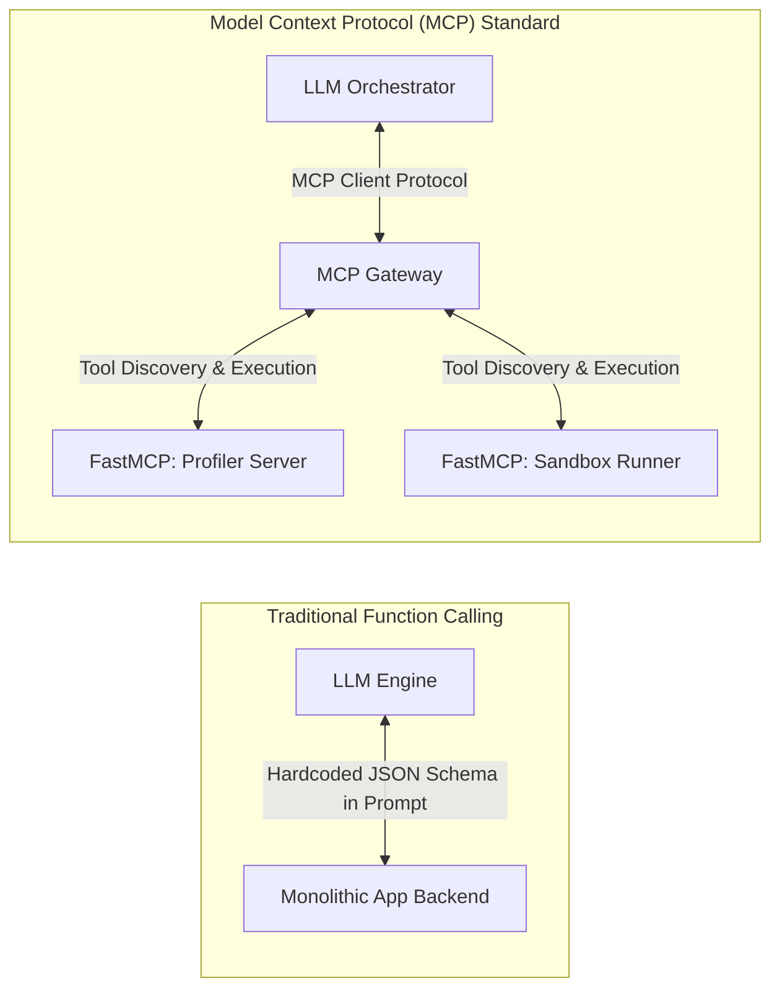
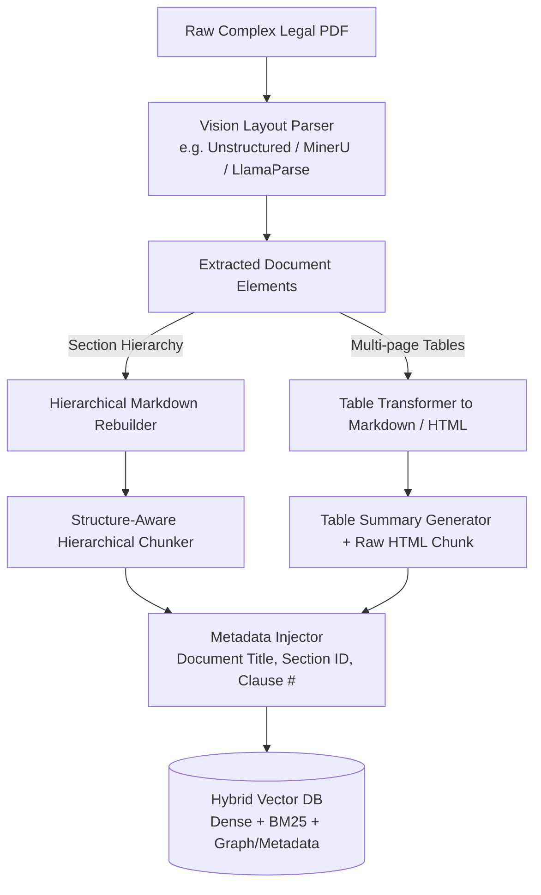
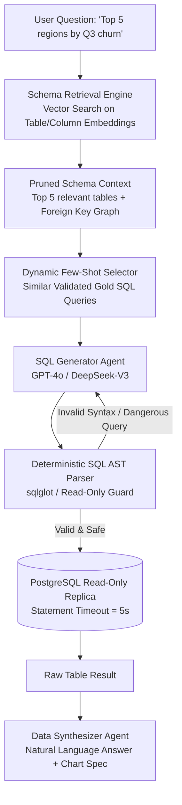

# AutoML: Comprehensive Interview Mastery & Technical Defense Guide
## Module 2: 20 Advanced AI Engineer / GenAI / Data Science Interview Questions & Exhaustive Answers

---

### Introduction & Interview Strategy

This guide provides masterclass-level answers to 20 core architectural, machine learning, Generative AI, and system design questions. It is grounded in the real-world architecture of the **AutoML** platform (FastAPI, Next.js, Clerk RS256 JWKS, multi-agent cognitive loops, FastMCP, and isolated ZeroGPU/Docker sandboxes) and expands into enterprise AI engineering paradigms (RAG evaluation, GraphRAG, 70B LLM deployment, NL-to-SQL at scale, and low-level microservice optimization).

---

# Table of Contents
1. [Section 1: Multi-Agent Systems, Agentic Workflows & System Architecture (Q1–Q5)](#section-1-multi-agent-systems-agentic-workflows--system-architecture)
2. [Section 2: Machine Learning Fundamentals & Data Science Rigor (Q6–Q10)](#section-2-machine-learning-fundamentals--data-science-rigor)
3. [Section 3: Generative AI, RAG, Search & Knowledge Graphs (Q11–Q15)](#section-3-generative-ai-rag-search--knowledge-graphs)
4. [Section 4: Enterprise Scale, Production Deployment, LLM-as-a-Judge & Advanced System Design (Q16–Q20)](#section-4-enterprise-scale-production-deployment-llm-as-a-judge--advanced-system-design)

---

# Section 1: Multi-Agent Systems, Agentic Workflows & System Architecture

```
┌──────────────────────────────────────────────────────────────────────────────────────────────────┐
│             SECTION 1: AGENTIC ARCHITECTURES, MULTI-AGENT SYSTEMS & MCP (Q1 - Q5)               │
└──────────────────────────────────────────────────────────────────────────────────────────────────┘
```

---

### Question 1: Explain the multi-agent architecture of your AutoML platform. Why did you choose a decomposed multi-agent system (Planner, Coder, Debugger) over a single monolithic LLM prompt?

#### What the Interviewer is Testing:
* Understanding of cognitive load decomposition in LLMs.
* Ability to design robust agentic workflows vs. brittle single-prompt chains.
* Knowledge of error isolation, state boundaries, and deterministic vs. stochastic execution.

#### Comprehensive Answer:
In our AutoML platform, attempting to solve end-to-end model creation with a single monolithic prompt (e.g., *"Take this dataset profile, clean the data, write the sklearn code, tune it, test it, and output the final model"*) failed consistently due to **cognitive overload, attention degradation over long context, and compounding hallucinations**.

We decomposed the pipeline into three specialized cognitive agents with distinct personas, structured inputs, and clear handoff contracts:

```
[ Dataset Profile ] ──► [ Planner Agent ] ──► [ Coder Agent ] ──► [ Sandbox Execution ]
                              ▲                                            │
                              │                                            ▼
                              └───────────── [ Debugger Agent ] ◄── (Error / Low Score)
```

1. **Planner Agent (Statistical Architect):**
   * *Responsibility:* Pure reasoning and statistical strategy. It does not write executable code.
   * *Input:* Schema metadata, missing value counts, column data types, target variable, task type, and user-selected model.
   * *Output:* An 8-stage Markdown checklist specifying precise statistical rules: imputation strategies (mean vs. mode), feature scaling (`StandardScaler`), one-hot encoding with `handle_unknown='ignore'`, dynamic VIF collinearity checks, 80/20 train/test splitting, metric definitions, and diagnostic plotting.
2. **Coder Agent (Pipeline Synthesizer):**
   * *Responsibility:* Translating the structured plan into syntactically flawless, production-grade Python code.
   * *Input:* Markdown plan, column arrays, and the raw base64-encoded dataset string.
   * *Output:* A self-contained script using `sklearn.compose.ColumnTransformer`, dynamic model imports, metric logging to `stdout` with `[METRIC]`, and artifact generation.
3. **Debugger & Optimizer Agent (Self-Correction Specialist):**
   * *Responsibility:* Fault analysis and iterative refinement.
   * *Input:* Failed script, `stderr` traceback or performance metric shortfall ($Score < Threshold$), and original plan.
   * *Output:* Repaired and optimized Python code.

#### Why Decomposition Wins:
* **Separation of Concerns:** Reasoning about statistical methodology is separated from code syntax and package API compliance.
* **Token Efficiency:** The Planner operates on tiny metadata JSON ($< 1\text{ KB}$), keeping its reasoning context pristine.
* **Targeted Error Recovery:** When a script crashes, we do not re-plan the entire strategy; we pass only the execution trace and failed code to the Debugger Agent, saving 70% in inference latency and token costs.

---

### Question 2: How does the Model Context Protocol (MCP) function in your system, and how does it compare to standard REST APIs or traditional LLM Function Calling?

#### What the Interviewer is Testing:
* Architectural knowledge of modern open standards for AI tooling (Anthropic/OpenAI MCP standard).
* Understanding of tool discovery, decoupled capability exposure, and protocol abstraction.

#### Comprehensive Answer:
**Model Context Protocol (MCP)** is an open standard that standardizes how AI applications provide context and tools to LLMs via JSON-RPC 2.0 transport (over `stdio` or SSE/HTTP).



#### Comparison Matrix:

| Dimension | Standard REST APIs | Traditional LLM Function Calling | Model Context Protocol (MCP) |
| :--- | :--- | :--- | :--- |
| **Discovery** | Hardcoded OpenAPI/Swagger endpoints. | Manual JSON schema injected into LLM prompt payload. | **Dynamic Protocol Discovery** (`mcp.list_tools()`). |
| **Coupling** | High coupling between orchestrator and API. | High coupling to specific model vendor APIs (OpenAI format vs. Anthropic format). | **Decoupled Client-Server Standard**; vendor-agnostic. |
| **Security Boundary** | Handled at API Gateway layer. | In-process execution within the client backend. | **Process Isolation** (MCP servers can run in sandboxed subprocesses or air-gapped containers). |
| **State & Streaming** | Stateless HTTP request/response. | Stateless JSON argument generation. | **Stateful bidirectional RPC**, supporting progress notifications and resource subscriptions. |

#### Implementation in AutoML:
We implemented two decoupled FastMCP servers (`mcp_servers/profiler_server.py` and `mcp_servers/sandbox_server.py`):
* **Data Profiler Server:** Exposes `profile_dataset(file_path)` and `get_sample_rows(file_path, n=5)`.
* **Sandbox Execution Server:** Exposes `execute_script_safely(script_content, timeout)` and `validate_pipeline(model_path, preprocessor_path)`.
* **The Benefit:** If we switch the backend orchestrator from FastAPI to LangGraph, CrewAI, or n8n, the underlying tools require zero code changes because they conform strictly to the MCP specification.

---

### Question 3: How do you design a reliable LLM Self-Correction loop in production, and how do you prevent infinite oscillation, catastrophic divergence, or hallucinated fixes?

#### What the Interviewer is Testing:
* Real-world experience with autonomous agent failure modes.
* Convergence guarantees, stopping conditions, and prompt engineering for debugging.

#### Comprehensive Answer:
A naive self-correction loop (`while not success: ask_llm(error)`) in production often degenerates into **infinite loops**, **hallucinatory thrashing** (fixing one bug while introducing another), or **catastrophic divergence** (completely changing the model architecture instead of fixing a syntax error).

```
                        ┌──────────────────────────────────────────────┐
                        │      SELF-CORRECTION CONVERGENCE ENGINE      │
                        └──────────────────────────────────────────────┘

    [ Execution Result ] ──► (Exit Code != 0?) ──► [ Syntax / Runtime Classifier ] ──► Inject Stderr & Code
             │
             └─────────────► (Score < Threshold?) ──► [ Performance Classifier ]   ──► Inject Score Delta & Plan
                                                                   │
                                                                   ▼
                                                     [ Strict System Prompt ]
                                                     • Keep original pipeline structure
                                                     • Modify ONLY the fault location
                                                     • Raw code output only (No markdown)
                                                                   │
                                                                   ▼
                                                     [ Hard Counter: MAX_ATTEMPTS = 5 ]
                                                     (Exit with best result if threshold unreachable)
```

#### Our 5-Layer Convergence Architecture:
1. **Deterministic State Classification:**
   The orchestrator evaluates the sandbox output deterministically before invoking the Debugger:
   * *Class A: Runtime Crash ($ExitCode \neq 0$)* $\rightarrow$ Passes `stderr` traceback + failed code + plan.
   * *Class B: Performance Shortfall ($Score < Threshold$)* $\rightarrow$ Passes current metric score + required threshold + plan.
2. **Context Anchoring via Original Plan:**
   We always inject the **original Markdown Plan** into the Debugger prompt. This prevents the LLM from rewriting the entire architecture (e.g., swapping Random Forest for a Neural Network when only a scalar dimension was mismatched).
3. **Strict Output Sanitization & Markdown Stripping:**
   LLMs frequently wrap code in markdown fences (` ```python `) or prepend apologies (*"I apologize for the error, here is the fix..."*). We apply deterministic regex sanitizers:
   ```python
   code = re.sub(r"^```python\s*", "", code, flags=re.IGNORECASE)
   code = re.sub(r"^```\s*", "", code)
   code = re.sub(r"\s*```$", "", code).strip()
   ```
4. **Hard Iteration Ceilings & Graceful Degradation:**
   We enforce `MAX_ATTEMPTS = 5`. If the model fails to reach a $95\%$ accuracy threshold after 5 iterations but achieves $92\%$, the loop breaks gracefully, packages the $92\%$ model, and logs a `[WARN]` tag to the user rather than crashing the pipeline.
5. **Execution Timeout Guards:**
   To prevent generated code from hanging forever on massive grid searches, subprocesses are bounded by a hard `timeout=60s`. A timeout event triggers `subprocess.TimeoutExpired`, which is fed back to the Debugger as an instruction to reduce search hyperparameter combinations.

---

### Question 4: In an autonomous Code Generation and Execution system, how do you eliminate Remote Code Execution (RCE) vulnerabilities and manage sandbox constraints?

#### What the Interviewer is Testing:
* Systems security, virtualization, container isolation, and defense-in-depth against malicious code generation.

#### Comprehensive Answer:
Allowing an LLM to generate arbitrary Python code and executing it on your infrastructure creates severe **Remote Code Execution (RCE)** vulnerabilities: an attacker (or a hallucinating LLM) could execute `os.system("rm -rf /")`, read environment variables (`OPENAI_API_KEY`, `CLERK_SECRET_KEY`), or launch DDoS attacks from your server.

```
┌──────────────────────────────────────────────────────────────────────────────────────────────────┐
│                                   DEFENSE-IN-DEPTH SANDBOX TOPOLOGY                              │
└──────────────────────────────────────────────────────────────────────────────────────────────────┘

   [ Client Request ] ──► [ FastAPI Host (Render) ]
                                 │
                                 │ (Passes Code over Isolated Network Boundary)
                                 ▼
                     ┌─────────────────────────────────────────────────────────┐
                     │            EPHEMERAL SANDBOX RUNTIME                    │
                     │  (Hugging Face ZeroGPU / Local Docker Container)       │
                     ├─────────────────────────────────────────────────────────┤
                     │ 1. Zero Network Access (`--network none`)               │
                     │ 2. Read-Only Root Filesystem + Ephemeral TempDir        │
                     │ 3. Strict Memory Limits (`mem_limit="1g"`)              │
                     │ 4. Deterministic Timeouts (`timeout=60s`)               │
                     │ 5. Isolated Subprocess (`sys.executable`)               │
                     │ 6. Memory Zip Buffer & Automatic Disk Scrubbing         │
                     └─────────────────────────────────────────────────────────┘
```

#### Our Defense-in-Depth Implementation:
1. **Network Air-Gapping (`--network none`):**
   In our Docker sandbox, containers are initialized with `network_mode="none"`. The executing script has zero socket access, eliminating data exfiltration risks and outbound botnet activity.
2. **Ephemeral In-Memory Temporary Directories:**
   In the ZeroGPU Hugging Face sandbox (`sandbox/app.py`), code executes inside `tempfile.TemporaryDirectory()`. The script cannot write to the root filesystem. Once execution completes and generated artifacts are compressed into an in-memory `io.BytesIO()` ZIP buffer, the temporary directory is instantly scrubbed from disk.
3. **Resource Quotas & Process Boundaries:**
   * *Memory Cap:* Docker containers enforce `mem_limit="1g"`, preventing memory exhaustion / OOM attacks on the host.
   * *Execution Timeout:* Every execution is managed via `subprocess.run(..., timeout=60)`. If a process hangs, the kernel terminates the PID tree cleanly.
4. **Environment Variable Cloaking:**
   The execution sandbox environment possesses **zero API keys or secrets**. Secrets (OpenAI keys, Clerk secrets, DB credentials) exist strictly in the FastAPI gateway tier.

---

### Question 5: How do you manage LLM context windows and token economics when dealing with multi-megabyte tabular datasets?

#### What the Interviewer is Testing:
* Pragmatic understanding of context limits, token cost optimization, and data representation trade-offs.

#### Comprehensive Answer:
Passing a 50MB CSV dataset ($500,000$ rows) directly into an LLM context window is **technically infeasible and economically catastrophic**:
1. It exceeds standard context limits ($128\text{k}$ tokens $\approx 400\text{ KB}$ of raw text).
2. Processing millions of tabular tokens costs tens of dollars per API call and introduces massive latency ($> 60\text{ seconds}$).
3. LLMs are poor tabular calculation engines compared to deterministic vectorized libraries like `pandas` and `numpy`.

#### Our Distillation & Base64 In-Memory Strategy:
```
[ Raw Dataset (50MB) ] ──► [ Profiler MCP ] ──► Metadata JSON (< 1KB) ──► [ Planner Agent ]
                                                        │
                                                        ▼
[ Coder Agent ] ◄── Markdown Plan + Schema + Injected Base64 Chunk
        │
        ▼
[ Standalone Script with Embedded Base64 ] ──► [ Isolated Sandbox ] (Pandas decodes & executes locally)
```

1. **Statistical Distillation (The Profiler):**
   The raw dataset is ingested by the FastMCP Profiler Server. It extracts only:
   * Dimensions: $(N_{rows}, N_{cols})$
   * Column names & Data Types (`int64`, `float64`, `object`, `datetime`)
   * Missing value counts & Cardinality
   * Target class distribution
   * Total token footprint sent to Planner Agent: **$< 300\text{ tokens}$**.
2. **Base64 Ingestion inside the Sandbox:**
   For medium datasets, the Coder Agent writes a script that decodes the dataset from base64 directly in memory within the sandbox runtime:
   ```python
   import base64, io, pandas as pd
   df = pd.read_csv(io.StringIO(base64.b64decode(CSV_BASE64).decode('utf-8')))
   ```
   For large datasets, the script loads the file from the local mounted volume path (`/workspace/host_dir/dataset.csv`).
3. **Outcome:** The LLM acts purely as the **code synthesizer and orchestrator**, while the **heavy data transformation and numeric crunching execute natively in Python/C-accelerated Scikit-Learn at bare-metal speeds**.

---

# Section 2: Machine Learning Fundamentals & Data Science Rigor

```
┌──────────────────────────────────────────────────────────────────────────────────────────────────┐
│             SECTION 2: ML FUNDAMENTALS, MATHEMATICS & DATA SCIENCE RIGOR (Q6 - Q10)             │
└──────────────────────────────────────────────────────────────────────────────────────────────────┘
```

---

### Question 6: Explain Overfitting vs. Underfitting along with the deep mathematics and geometric intuition of $L_1$ (Lasso) and $L_2$ (Ridge) regularizers. Why does $L_1$ produce sparsity while $L_2$ does not?

#### What the Interviewer is Testing:
* Fundamental ML mathematical rigor (Loss functions, Lagrangian multipliers, contour geometries).
* Bias-Variance tradeoff.

#### Comprehensive Answer:

#### 1. Overfitting vs. Underfitting (Bias-Variance Tradeoff)
* **Underfitting (High Bias, Low Variance):** The model is too simplistic to capture the underlying data manifold (e.g., fitting a linear model to a quadratic relationship). Training error is high, and test error is equally high.
* **Overfitting (Low Bias, High Variance):** The model memorizes training noise and idiosyncrasies rather than the true data-generating distribution. Training error is near zero, but generalization error on test data explodes.

```
Total Expected Error = Bias^2 + Variance + Irreducible Error (σ^2)
```

---

#### 2. Mathematical Formulation of Regularization
To combat overfitting, we add a penalty term $\Omega(w)$ to the empirical loss function:
$$\min_{w} \mathcal{L}(w) + \lambda \Omega(w)$$

* **$L_2$ Regularization (Ridge Regression):**
  $$\mathcal{L}_{Ridge}(w) = \frac{1}{2N} \sum_{i=1}^{N} (y_i - w^T x_i)^2 + \frac{\lambda}{2} \|w\|_2^2 = \text{MSE}(w) + \frac{\lambda}{2} \sum_{j=1}^{D} w_j^2$$
  Taking the gradient with respect to $w$:
  $$\nabla_w \mathcal{L}_{Ridge} = \nabla \text{MSE}(w) + \lambda w$$
  During gradient descent update:
  $$w^{(t+1)} = w^{(t)} - \eta (\nabla \text{MSE}(w^{(t)}) + \lambda w^{(t)}) = (1 - \eta \lambda) w^{(t)} - \eta \nabla \text{MSE}(w^{(t)})$$
  Here, $(1 - \eta \lambda)$ acts as **weight decay**, shrinking weights proportionally toward zero but never forcing them exactly to zero.

* **$L_1$ Regularization (Lasso Regression):**
  $$\mathcal{L}_{Lasso}(w) = \frac{1}{2N} \sum_{i=1}^{N} (y_i - w^T x_i)^2 + \lambda \|w\|_1 = \text{MSE}(w) + \lambda \sum_{j=1}^{D} |w_j|$$
  Since $|w_j|$ is non-differentiable at $w_j = 0$, we compute the subgradient:
  $$\frac{\partial |w_j|}{\partial w_j} = \text{sign}(w_j) = \begin{cases} +1 & w_j > 0 \\ -1 & w_j < 0 \\ [-1, 1] & w_j = 0 \end{cases}$$
  The update subtracts a constant step $\eta \lambda \cdot \text{sign}(w_j)$, driving parameters directly to zero.

---

#### 3. Geometric Intuition: Why $L_1$ Produces Sparsity (Feature Selection)
Under constrained optimization (Karush-Kuhn-Tucker conditions), the regularization problem is equivalent to minimizing the loss contours subject to a constraint region:

$$\min_{w} \text{MSE}(w) \quad \text{subject to} \quad \Omega(w) \le C$$

```
              L1 Constraint (Diamond)                  L2 Constraint (Circle)
                     w2                                        w2
                     ▲                                         ▲
                     │                                         │
                   /   \    Loss Contours                   .-----.   Loss Contours
                 /       \   (Ellipses)                   .'       '.  (Ellipses)
               /     *────\────────►                    /     *──────\──────►
             /   (Corner)   \                         /               \
             ◄───────┼───────► w1                     ◄───────┼───────► w1
             \               /                         \             /
               \           /                            '.         .'
                 \       /                                '-------'
                   \   /
                     ▼                                         ▼
        Tangent hits CORNER (w1=0)               Tangent hits SMOOTH ARC (w1≠0, w2≠0)
```

* **$L_1$ Ball (Diamond / Cross-Polytope in $D$ dimensions):** The $L_1$ ball has sharp corners aligned with the coordinate axes where one or more $w_j = 0$. As the elliptical loss contours expand from the unconstrained OLS minimum, they almost always touch the diamond at a **sharp corner**, setting non-essential feature weights **identically to zero** (performing automatic feature selection).
* **$L_2$ Ball (Hypersphere):** The $L_2$ ball is completely smooth. The loss contour touches the circle at an arbitrary point along the curve where both $w_1, w_2 \neq 0$. Thus, $L_2$ shrinks coefficients uniformly but **never produces sparse representations**.

---

### Question 7: What is Multicollinearity, why is it fatal for linear models, and how is the Variance Inflation Factor (VIF) calculated mathematically? How did you automate VIF pruning without heavy external packages?

#### What the Interviewer is Testing:
* Matrix algebra, stability of $(X^T X)^{-1}$, statistical diagnostics, and lightweight production implementation.

#### Comprehensive Answer:

#### 1. Why Multicollinearity is Fatal:
In linear models ($y = Xw + \epsilon$), the Ordinary Least Squares (OLS) closed-form solution is:
$$\hat{w} = (X^T X)^{-1} X^T y$$
The variance-covariance matrix of the parameter estimates is:
$$\text{Var}(\hat{w}) = \sigma^2 (X^T X)^{-1}$$

When two or more features are highly collinear (e.g., $x_2 \approx 2 x_1$), columns of matrix $X$ become linearly dependent, causing the Gram matrix $X^T X$ to be **singular or near-singular** ($\det(X^T X) \approx 0$).
* **Consequences:**
  1. The inverse matrix $(X^T X)^{-1}$ explodes.
  2. The variance $\text{Var}(\hat{w}_j)$ of the coefficients shoots to infinity.
  3. Coefficients become highly unstable, wild swings occur with tiny data perturbations, and p-values become meaningless, destroying model interpretability.

---

#### 2. Mathematics of Variance Inflation Factor (VIF)
The VIF for feature $j$ measures how much the variance of coefficient $\hat{w}_j$ is inflated compared to when all features are completely orthogonal:

$$\text{VIF}_j = \frac{1}{1 - R_j^2}$$

Where $R_j^2$ is the coefficient of determination obtained from regressing feature $x_j$ against **all other remaining independent features**:
$$x_j = \alpha_0 + \sum_{k \neq j} \alpha_k x_k + \epsilon$$

* $\text{VIF} = 1$: Zero collinearity (orthogonal features).
* $1 < \text{VIF} < 5$: Moderate, acceptable collinearity.
* $\text{VIF} > 5$ or $10$: Severe multicollinearity ($R_j^2 > 0.80$); feature must be pruned.

---

#### 3. Lightweight Automated VIF Implementation in AutoML:
Standard data science pipelines import `from statsmodels.stats.outliers_influence import variance_inflation_factor`, which introduces a heavy 40MB dependency.
In our Coder Agent, we instructed the model to synthesize a native Scikit-Learn loop:

```python
from sklearn.linear_model import LinearRegression
import numpy as np

def calculate_vif_and_prune(X_df, threshold=5.0):
    features = list(X_df.columns)
    while True:
        vif_values = []
        for col in features:
            other_cols = [c for c in features if c != col]
            if not other_cols:
                break
            X_other = X_df[other_cols].values
            y_target = X_df[col].values
            
            # Fit linear model to compute R^2
            reg = LinearRegression().fit(X_other, y_target)
            r2 = reg.score(X_other, y_target)
            
            # Calculate VIF
            vif = 1.0 / (1.0 - r2) if r2 < 0.9999 else 1e5
            vif_values.append((col, vif))
            
        # Find feature with maximum VIF
        max_col, max_vif = max(vif_values, key=lambda x: x[1]) if vif_values else (None, 0)
        
        if max_vif > threshold and len(features) > 1:
            features.remove(max_col)
            print(f"[VIF PRUNE] Dropped collinear feature '{max_col}' (VIF: {max_vif:.2f})")
        else:
            break
            
    return X_df[features]
```

---

### Question 8: What is Data Leakage, what are its insidious forms in ML pipelines, and how does your automated pipeline guarantee zero leakage between train and test distributions?

#### What the Interviewer is Testing:
* Production ML discipline, cross-validation integrity, and understanding subtle feature-pipeline bugs.

#### Comprehensive Answer:

#### 1. What is Data Leakage?
Data leakage occurs when information from outside the training dataset (specifically from the target variable or the test/validation set) is used to create or tune the model. It produces overly optimistic training/validation scores that collapse in production.

#### 2. Three Insidious Forms of Leakage:
1. **Global Preprocessing Leakage (The Most Common Mistake):**
   * *The Bug:* Computing `StandardScaler().fit_transform(X)` or `SimpleImputer(strategy='mean').fit_transform(X)` over the **entire dataset** before calling `train_test_split`.
   * *Why it leaks:* The global mean $\mu$ and standard deviation $\sigma$ incorporate data points from the test set. When the model evaluates on the test set, it has already "seen" the distribution of test features.
2. **Target Encoding Leakage:**
   * Computing the mean target value for high-cardinality categorical features using the full dataset.
3. **Temporal / Time-Series Leakage:**
   * Randomly shuffling time-series data using standard K-Fold cross-validation instead of `TimeSeriesSplit`, allowing future information to predict past events.

---

#### 3. How AutoML Guarantees Zero Data Leakage:
Our Planner and Coder Agents enforce strict architectural isolation using Scikit-Learn `Pipeline` and `ColumnTransformer`:

```
                       RAW INGESTED DATASET
                                │
                                ▼
                   [ train_test_split(80/20) ]
                    /                        \
                   /                          \
        [ X_train, y_train ]            [ X_test, y_test ]
                 │                               │
                 ▼                               │ (Untouched)
        ColumnTransformer.fit()                  │
                 │                               │
                 ▼                               ▼
       X_train_transformed             ColumnTransformer.transform()
                 │                               │
                 ▼                               ▼
            Model.fit() ────────────────► Model.predict()
```

1. **Step 1: Train/Test Partitioning First:** `train_test_split(X, y, test_size=0.20, random_state=42)` executes before any statistical computation.
2. **Step 2: Fit on Train Only:**
   ```python
   preprocessor = ColumnTransformer(transformers=[
       ('num', Pipeline([('imputer', SimpleImputer(strategy='mean')), ('scaler', StandardScaler())]), num_cols),
       ('cat', Pipeline([('imputer', SimpleImputer(strategy='most_frequent')), ('ohe', OneHotEncoder(handle_unknown='ignore'))]), cat_cols)
   ])
   
   # FIT EXCLUSIVELY ON TRAIN
   X_train_processed = preprocessor.fit_transform(X_train)
   
   # TRANSFORM TEST (NO FIT ALLOWED)
   X_test_processed = preprocessor.transform(X_test)
   ```
3. **Step 3: Isolated Artifact Serialization:** `preprocessor.pkl` stores only the parameters ($\mu_{train}, \sigma_{train}$, category mappings) derived exclusively from $X_{train}$.

---

### Question 9: Which vector would be longer—dense or sparse? Explain the mathematical representations, storage trade-offs, dimensionality, and retrieval characteristics of dense vs. sparse embeddings.

#### What the Interviewer is Testing:
* Vector mathematics, embedding spaces, memory storage models (CSR/COO), and search mechanics (BM25 vs. HNSW).

#### Comprehensive Answer:

#### 1. The Core Answer:
* **In terms of Dimensionality (Length of Vector Space):** A **Sparse Vector is far longer** (typically $30,000$ to $100,000+$ dimensions, equal to the entire vocabulary size $|V|$), whereas a **Dense Vector is much shorter** (typically $384$, $768$, $1536$, or $3072$ dimensions).
* **In terms of Non-Zero Elements (Storage Footprint):** A **Dense Vector is longer in active stored values** (every single float is non-zero, e.g., $1536 \times 4\text{ bytes} \approx 6\text{ KB}$), whereas a Sparse Vector stores only the non-zero indices and their values (e.g., $10$ active terms $\approx 80\text{ bytes}$).

```
Sparse Vector (Dimension = 50,000 | Non-zero entries = 3)
[0, 0, 0, 1.42, 0, 0, 0, ..., 0, 3.11, 0, ..., 0.89, 0]  ──► Stored as: {(3: 1.42), (24102: 3.11), (48901: 0.89)}

Dense Vector (Dimension = 768 | Non-zero entries = 768)
[-0.0412, 0.1892, 0.0034, -0.8712, 0.5123, ..., 0.1145]  ──► Stored as: Float32 Array of length 768
```

---

#### 2. Deep Comparison:

| Dimension | Sparse Vectors (e.g., BM25, TF-IDF, SPLADE) | Dense Vectors (e.g., OpenAI text-embedding-3, BERT) |
| :--- | :--- | :--- |
| **Dimensionality ($D$)** | High ($10^4 - 10^6$ dimensions). | Low ($256 - 3072$ dimensions). |
| **Non-Zero Values** | Highly sparse ($< 0.1\%$ non-zero). | Dense ($100\%$ non-zero floats). |
| **Mathematical Meaning** | Exact lexical match / term frequency weights. | Latent semantic concepts & contextual relationships. |
| **Data Structure** | Inverted Index / Compressed Sparse Row (CSR). | Flat Array / HNSW Index (Hierarchical Navigable Small World). |
| **Search Mechanism** | Boolean intersection + posting list traversal. | Approximate Nearest Neighbor (ANN) via Cosine / Dot Product. |
| **Failure Mode** | Vocabulary mismatch (*"automobile"* vs. *"car"*). | Specificity loss on exact SKU IDs, part numbers, or rare acronyms. |

---

### Question 10: How do you select and evaluate classification metrics under extreme class imbalance (Accuracy vs. F1 vs. PR-AUC vs. ROC-AUC), and how does your pipeline handle target distribution shifts?

#### What the Interviewer is Testing:
* Metric selection rigor in imbalanced domains (e.g., fraud detection with 99.9% negative class), threshold tuning, and distribution awareness.

#### Comprehensive Answer:

#### 1. The Accuracy Paradox under Imbalance:
In a dataset with $99\%$ Class 0 and $1\%$ Class 1 (e.g., credit card fraud), a naive model predicting constantly $y=0$ achieves **$99\%$ Accuracy**, yet is completely useless.
* **Accuracy is disqualified** when class distributions are skewed.

---

#### 2. Metric Decision Matrix:

```
                                  CLASS IMBALANCE METRIC GUIDE
                                                │
                 ┌──────────────────────────────┴──────────────────────────────┐
                 ▼                                                             ▼
        [ Balanced Classes ]                                         [ Highly Imbalanced Classes ]
         • Accuracy                                                   (e.g., Fraud, Rare Diseases)
         • ROC-AUC (Measures ranking ability across all thresholds)     │
                                                                       ├───────────────────────────────┐
                                                                       ▼                               ▼
                                                            [ PR-AUC (Avg Precision) ]      [ F1-Score / F-Beta ]
                                                            Focuses exclusively on the       Harmonic mean of P & R.
                                                            rare positive minority class.    F2 if Recall > Precision.
```

* **ROC-AUC (Receiver Operating Characteristic):** Plots True Positive Rate (TPR) vs. False Positive Rate (FPR):
  $$\text{TPR} = \frac{\text{TP}}{\text{TP} + \text{FN}}, \quad \text{FPR} = \frac{\text{FP}}{\text{FP} + \text{TN}}$$
  * *The Flaw:* Because True Negatives ($\text{TN}$) is massive, $\text{FPR}$ stays artificially near zero even with hundreds of false alarms ($\text{FP}$). ROC-AUC gives an overly optimistic assessment of model quality.
* **PR-AUC (Precision-Recall AUC):** Plots Precision vs. Recall:
  $$\text{Precision} = \frac{\text{TP}}{\text{TP} + \text{FP}}, \quad \text{Recall} = \frac{\text{TP}}{\text{TP} + \text{FN}}$$
  * *Why PR-AUC is Superior:* Precision directly measures the cost of False Positives relative to True Positives, without being masked by a huge True Negative count.

---

#### 3. How AutoML Handles Imbalance:
1. **Metric Auto-Switching:** When the Profiler MCP detects a target class distribution ratio $> 80:20$, the Planner Agent automatically demotes Accuracy and promotes **Macro F1-Score** and **PR-AUC** as the primary optimization loss.
2. **Algorithmic Compensation:** The Coder Agent injects `class_weight='balanced'` into estimators (e.g. `LogisticRegression(class_weight='balanced')` or `RandomForestClassifier(class_weight='balanced_subsample')`), adjusting loss penalties inversely proportional to class frequencies:
   $$w_c = \frac{N}{K \cdot N_c}$$

---

# Section 3: Generative AI, RAG, Search & Knowledge Graphs

```
┌──────────────────────────────────────────────────────────────────────────────────────────────────┐
│              SECTION 3: RAG, SEARCH, KNOWLEDGE GRAPHS & GENAI PIPELINES (Q11 - Q15)              │
└──────────────────────────────────────────────────────────────────────────────────────────────────┘
```

---

### Question 11: How do you comprehensively evaluate a RAG system? Walk through retrieval metrics (Precision@K, Recall@K, MRR, NDCG), generation metrics (RAGAS framework), and production evaluation pipelines.

#### What the Interviewer is Testing:
* End-to-end understanding of RAG evaluation across retrieval, generation, and operational pipelines (RAGAS framework, offline golden test sets, online telemetry).

#### Comprehensive Answer:

Evaluating a RAG system requires a **tri-level evaluation framework**:

```
                              ┌──────────────────────────────────────────────┐
                              │         TRI-LEVEL RAG EVALUATION MATRIX      │
                              └──────────────────────────────────────────────┘

    [ RETRIEVAL METRICS ]               [ GENERATION METRICS (RAGAS) ]            [ PRODUCTION END-TO-END ]
   ───────────────────────             ────────────────────────────────          ───────────────────────────
   • Precision@K                       • Faithfulness (Grounding)                • Answer Correctness (vs GT)
   • Recall@K                          • Answer Relevance                        • User Thumbs Up / Down Rate
   • MRR (Mean Reciprocal Rank)        • Context Relevance                       • Latency (TTFT & Total P99)
   • NDCG@K (Position Discount)        • Context Recall                          • Token Cost / Query
```

---

#### 1. Retrieval Metrics (Did we fetch the right context?):
* **$\text{Precision}@K$:** What fraction of the $K$ retrieved chunks are genuinely relevant?
  $$\text{Precision}@K = \frac{|\text{Relevant Docs} \cap \text{Retrieved Docs}@K|}{K}$$
* **$\text{Recall}@K$:** What fraction of all known ground-truth relevant chunks were successfully retrieved in top $K$?
  $$\text{Recall}@K = \frac{|\text{Relevant Docs} \cap \text{Retrieved Docs}@K|}{|\text{Total Relevant Docs}|}$$
* **MRR (Mean Reciprocal Rank):** How high in the ranking is the *first* relevant chunk?
  $$\text{MRR} = \frac{1}{|Q|} \sum_{i=1}^{|Q|} \frac{1}{\text{rank}_i}$$
  If the first relevant document is at position 1, $\text{RR} = 1.0$; if at position 4, $\text{RR} = 0.25$.
* **NDCG@K (Normalized Discounted Cumulative Gain):** Evaluates graded relevance while heavily penalizing relevant documents ranked low:
  $$\text{DCG}@K = \sum_{i=1}^{K} \frac{2^{rel_i} - 1}{\log_2(i + 1)}, \quad \text{NDCG}@K = \frac{\text{DCG}@K}{\text{IDCG}@K}$$

---

#### 2. Generation Metrics (RAGAS Framework):
* **Faithfulness (Detects Hallucinations):** Evaluates if every claim in the generated answer $A$ can be directly inferred from the retrieved context $C$:
  $$\text{Faithfulness} = \frac{|\text{Claims in Answer supported by Context}|}{|\text{Total Claims in Answer}|}$$
* **Answer Relevance:** Evaluates if the generated answer directly addresses the original query $Q$ (regardless of context accuracy).
* **Context Relevance:** Evaluates whether retrieved chunks contain only relevant facts or are filled with irrelevant noise.
* **Context Recall:** Measures if the retrieved context contains all necessary facts to construct the ground-truth answer.

---

#### 3. Production Evaluation Pipeline:
```
[ Golden Test Set (200+ QA Pairs) ] ──► [ Automated CI/CD Gate ] ──► (Faithfulness > 0.85 & Relevance > 0.80?)
                                                                                  │
                                              ┌───────────────────────────────────┴───────────────────────────────────┐
                                              ▼                                                                       ▼
                                        (Pass: Deploy)                                                      (Fail: Block Deployment)
                                              │
                                              ▼
                               [ Production Telemetry (5% Sample) ] ──► [ RAGAS Eval ] + [ User CSAT / Thumbs ]
```

---

### Question 12: Compare Semantic Search (dense embeddings) vs. Keyword Search (BM25 sparse tokens). When does each fail, and how do you implement Reciprocal Rank Fusion (RRF) for hybrid retrieval?

#### What the Interviewer is Testing:
* Lexical vs. vector retrieval trade-offs, fusion ranking algorithms, and solving edge cases in search.

#### Comprehensive Answer:

#### 1. Why Single-Retrieval Strategies Fail:
* **When Semantic (Dense) Search Fails:**
  * Exact alphanumeric keywords, part numbers, legal clause citations (e.g., *"Section 409A"*), error codes (`HTTP 502`), or rare acronyms. Dense models project them into general semantic neighborhoods, missing the exact token.
* **When Keyword (BM25) Search Fails:**
  * Vocabulary mismatch problem (searching *"heart attack"* fails to retrieve documents mentioning *"myocardial infarction"*).
  * Natural language queries with conversational phrasing.

---

#### 2. The Hybrid Solution: Reciprocal Rank Fusion (RRF)
Rather than attempting to normalize and combine raw Cosine Similarity scores ($0.0 \text{ to } 1.0$) with unbounded BM25 scores ($0 \text{ to } 40+$), **Reciprocal Rank Fusion (RRF)** computes a combined score based purely on the **rank positions** across both retrieval lists:

$$\text{RRF\_Score}(d \in D) = \sum_{m \in M} \frac{1}{k + r_m(d)}$$

Where:
* $M$ is the set of retrieval systems (e.g., Dense HNSW + Sparse BM25).
* $r_m(d)$ is the rank of document $d$ in system $m$ (1-indexed).
* $k$ is a constant smoothing hyperparameter (standard default $k = 60$).

```python
def reciprocal_rank_fusion(dense_results, sparse_results, k=60):
    """
    Combines two ranked document lists using Reciprocal Rank Fusion.
    """
    rrf_scores = {}
    
    for rank, doc_id in enumerate(dense_results, start=1):
        rrf_scores[doc_id] = rrf_scores.get(doc_id, 0.0) + (1.0 / (k + rank))
        
    for rank, doc_id in enumerate(sparse_results, start=1):
        rrf_scores[doc_id] = rrf_scores.get(doc_id, 0.0) + (1.0 / (k + rank))
        
    # Sort documents by accumulated RRF score descending
    sorted_docs = sorted(rrf_scores.items(), key=lambda item: item[1], reverse=True)
    return sorted_docs
```

---

### Question 13: How does chunk size affect retrieval quality, and how do you select the right embedding model for domain-specific RAG?

#### What the Interviewer is Testing:
* Ingestion engineering, embedding capacity trade-offs, and systematic model benchmarking.

#### Comprehensive Answer:

#### 1. Chunk Size Impact on Retrieval & Generation:

```
[ Very Small Chunks (64 - 128 Tokens) ]           [ Very Large Chunks (1024 - 2048 Tokens) ]
────────────────────────────────────────           ──────────────────────────────────────────
• High embedding specificity                       • Diluted embedding representation
• High Precision@K                                 • Lower Retrieval Precision (context noise)
• Lacks surrounding context for LLM reasoning      • High context for generation, but eats token budget
```

* **The Sweet Spot:** Hierarchical chunking (Parent-Child chunking) or **Sentence-Window Retrieval** (embed small 256-token chunks for high-precision retrieval, but inject the surrounding 1024-token parent context to the LLM during generation).

---

#### 2. Embedding Model Selection Criteria:
1. **MTEB (Massive Text Embedding Benchmark) Leaderboard Validation:** Select models based on task-specific sub-benchmarks (Retrieval vs. Semantic Textual Similarity vs. Classification).
2. **Context Length & Dimensionality:**
   * Standard: `text-embedding-3-large` (3072 dimensions, 8k context).
   * Open-Source / Self-Hosted: `BGE-M3` (multi-lingual, multi-granularity, supports dense + sparse + colbert representations) or `NV-Embed-v2`.
3. **Matryoshka Representation Learning (MRL):** Modern models allow truncating vector dimensions (e.g., 3072 down to 512) with $< 2\%$ loss in accuracy, slashing vector database memory and latency by $80\%$.

---

### Question 14: How does Knowledge Graph (KG) construction work from unstructured text, how is it used in GraphRAG, and what are the costs, trade-offs, and scalability bottlenecks?

#### What the Interviewer is Testing:
* Advanced knowledge modeling, GraphRAG, entity-relationship extraction pipelines, and cost/latency tradeoffs.

#### Comprehensive Answer:

#### 1. Knowledge Graph Construction Pipeline:
```
[ Unstructured Text Document ]
              │
              ▼
[ Entity & Relation Extraction ] ──► (LLM extracts Triples: <Subject, Predicate, Object>)
              │
              ▼
[ Entity Resolution & Disambiguation ] ──► (Merges "IBM", "Big Blue", "Intl Business Machines")
              │
              ▼
[ Graph Database Ingestion ] ──► (Nodes = Entities, Edges = Relationships, stored in Neo4j / AWS Neptune)
              │
              ▼
[ Community Detection (Leiden Algorithm) ] ──► (Hierarchical clustering of related nodes)
              │
              ▼
[ Community Summarization ] ──► (LLM pre-generates summaries for global multi-hop queries)
```

---

#### 2. Why GraphRAG Beats Standard Vector RAG on Global Queries:
* **Standard Vector RAG Failure:** If asked *"What are the top 3 high-level themes across the entire 500-page dataset?"*, vector search fails because no single chunk contains the global answer.
* **GraphRAG Advantage:** Traverses community summaries at top graph hierarchy levels to synthesize global multi-hop insights.

---

#### 3. Costs, Trade-offs & Bottlenecks:
* **Astronomical Ingestion Cost:** Extracting entities and triples across large corpora requires massive LLM calls ($10\times$ to $50\times$ more expensive than generating vector embeddings).
* **Entity Resolution Bottleneck:** Normalizing synonyms and disambiguating identical entity names across millions of nodes is computationally expensive and error-prone.
* **Query Latency:** Graph traversals (multi-hop graph queries) combined with vector search add $500\text{ms} - 2\text{s}$ overhead compared to flat sub-50ms vector queries.

---

### Question 15: How would you architect an end-to-end ingestion and RAG pipeline for complex enterprise legal documents containing nested sections, complex multi-page tables, and cross-references?

#### What the Interviewer is Testing:
* Document parsing architecture (layout analysis, OCR, vision-language models, table serialization), hierarchical chunking, and metadata tagging.

#### Comprehensive Answer:



#### Pipeline Engineering Steps:
1. **Layout-Aware Vision Parsing (Document AI):**
   * Use models like `LlamaParse`, `MinerU`, or `Azure Document Intelligence` rather than naive `pypdf`. Naive parsers scramble multi-column layouts and shred table rows.
2. **Table Processing Strategy:**
   * Tables are serialized into clean **HTML `<table>` or Markdown** representations.
   * Generate an **LLM summary of the table** for embedding search, while attaching the raw structural table as context payload for generation.
3. **Structure-Aware Hierarchical Chunking:**
   * Split documents along natural legal section boundaries (`Article`, `Section`, `Subsection`, `Paragraph`) rather than arbitrary character counts.
4. **Metadata Enrichment:**
   * Every chunk is injected with metadata: `{"doc_id": "...", "section": "12.3", "clause_title": "Indemnification", "page": 45}`. This allows precise pre-filtering during retrieval.

---

# Section 4: Enterprise Scale, Production Deployment, LLM-as-a-Judge & Advanced System Design

```
┌──────────────────────────────────────────────────────────────────────────────────────────────────┐
│             SECTION 4: SYSTEM DESIGN, 70B DEPLOYMENT & PRODUCTION SCALING (Q16 - Q20)            │
└──────────────────────────────────────────────────────────────────────────────────────────────────┘
```

---

### Question 16: How do you evaluate and calibrate an LLM-as-a-Judge system, and how do you eliminate positional bias, verbosity bias, and self-enhancement bias?

#### What the Interviewer is Testing:
* Advanced LLM evaluation methodology, statistical calibration against human benchmarks, and bias mitigation.

#### Comprehensive Answer:

Using a strong LLM (e.g. GPT-4o) to judge candidate outputs introduces well-known systematic biases:

```
┌──────────────────────────────────────────────────────────────────────────────────────────────────┐
│                                     LLM-AS-A-JUDGE BIAS TAXONOMY                                 │
└──────────────────────────────────────────────────────────────────────────────────────────────────┘

   1. POSITIONAL BIAS                   2. VERBOSITY BIAS                  3. SELF-ENHANCEMENT BIAS
  ──────────────────────               ───────────────────                ──────────────────────────
  Prefers whichever candidate is       Favors longer, wordier answers      Prefers answers generated by
  presented first (Position A).        over concise, accurate answers.     its own model family.
```

---

#### Mitigation Architecture & Calibration:
1. **Position Swapping (Bi-directional Evaluation):**
   Evaluate Candidate 1 and Candidate 2 in both orderings: `Prompt(A, B)` and `Prompt(B, A)`. If the judge reverses its preference when order changes, mark the result as a tie or discard.
2. **Reference-Guided Rubrics (Few-Shot Calibration):**
   Provide structured, explicit rubrics (1 to 5 scale) with strict definitions and reference ground-truth examples for each score level.
3. **Swap to Direct Scoring over Pairwise Comparisons:**
   Grade each candidate independently against a fixed rubric before running comparative evaluations.
4. **Human Agreement Calibration (Cohen's Kappa & Krippendorff's Alpha):**
   Sample 200 outputs, have them graded by human domain experts, and compute **Cohen’s Kappa ($\kappa$)**:
   $$\kappa = \frac{P_o - P_e}{1 - P_e}$$
   * Target $\kappa > 0.75$ before deploying an automated LLM judge to production CI/CD gates.

---

### Question 17: How would you architect and scale a Natural Language to SQL (NL-to-SQL) engine for an enterprise relational database with thousands of tables, ambiguous joins, and dynamic schemas?

#### What the Interviewer is Testing:
* Context pruning, schema retrieval, deterministic SQL validation, and database security.

#### Comprehensive Answer:



#### Core Architectural Pillars:
1. **Two-Stage Schema Pruning (Vector Search over DDL):**
   You cannot feed 1,000 tables into an LLM context. We maintain a vector index of **Table & Column semantic descriptions**. For a user query, we retrieve only the top 5–8 relevant tables and their Foreign Key relationships.
2. **Deterministic Abstract Syntax Tree (AST) Validation (`sqlglot`):**
   Before executing against the database:
   * Parse the SQL into an AST.
   * Verify that all table and column names exist in the schema.
   * **Security Rule:** Enforce `SELECT`-only statements; immediately reject any `DROP`, `UPDATE`, `INSERT`, or `ALTER`.
3. **Execution Guardrails:**
   * Execute on dedicated **read-only database replicas**.
   * Hard limits: `SET statement_timeout = '5000'`.
   * Automatically append `LIMIT 100` if absent.

---

### Question 18: How do you solve the cold-start latency problem when deploying a 70B parameter open-source LLM (e.g. Llama-3-70B) in production? Explain GPU memory layout, PagedAttention, Tensor Parallelism, and quantization.

#### What the Interviewer is Testing:
* Deep GPU hardware architecture, vLLM / TensorRT-LLM serving engines, and high-performance inference engineering.

#### Comprehensive Answer:

#### 1. The 70B Parameter Memory Footprint:
For a 70 Billion parameter model in 16-bit precision ($\text{FP16}$):
$$\text{Weight Memory} = 70 \times 10^9 \times 2\text{ bytes} \approx 140\text{ GB}$$
* To serve this model, you require at least **$2\times 80\text{GB}$ NVIDIA A100/H100 GPUs** just to hold the weights, plus additional memory for the KV Cache.

```
┌──────────────────────────────────────────────────────────────────────────────────────────────────┐
│                                70B MODEL COLD-START OPTIMIZATION                                 │
└──────────────────────────────────────────────────────────────────────────────────────────────────┘

   1. FAST WEIGHT LOADING                2. KV-CACHE EFFICIENCY             3. PARALLELISM & QUANTIZATION
  ────────────────────────              ──────────────────────             ───────────────────────────────
  • Safetensors + Direct I/O            • PagedAttention (vLLM)            • Tensor Parallelism (TP=2 or 4)
  • NVMe to GPU via GPUDirect           • Zero memory fragmentation        • FP8 / AWQ 4-bit Quantization
  • Warm pool standby instances         • Continuous Batching              • Cuts weight memory by 50-75%
```

---

#### 2. Deep Optimization Mechanisms:
1. **Eliminating Cold-Start Weight Loading Bottlenecks:**
   * *Problem:* Loading 140GB of weights from standard cloud storage over network takes 3–5 minutes.
   * *Solution:* Store weights in **`safetensors` format** on local high-throughput NVMe SSDs; load weights using **GPUDirect Storage (GDS)** directly into GPU VRAM, bypassing CPU RAM copy cycles (reducing boot time to under 15 seconds). Maintain a minimum warm-pool replica size ($N \ge 1$) to eliminate zero-state cold starts.
2. **Tensor Parallelism (TP = 2 / 4 / 8):**
   * Shards individual weight matrices (Query, Key, Value projections, and MLP layers) across multiple GPUs using Megatron-LM tensor parallel schemes with high-speed **NVLink interconnects** ($900\text{ GB/s}$).
3. **PagedAttention & Continuous Batching (vLLM Engine):**
   * *Traditional Serving Flaw:* Standard serving pre-allocates contiguous memory for the Key-Value (KV) Cache, causing $60\% - 80\%$ memory fragmentation.
   * *PagedAttention:* Treats KV-cache memory like virtual memory pages in operating systems. It allocates non-contiguous physical memory blocks on demand, boosting serving throughput by $3\times - 4\times$.
4. **Quantization (FP8 / AWQ / GPTQ):**
   * Using **FP8** (native on H100) or **AWQ 4-bit quantization** compresses the 70B model from 140GB down to **~38GB**, allowing it to fit on a **single 80GB GPU** with negligible ($< 1\%$) accuracy loss.

---

### Question 19: Apart from horizontal autoscaling, what system-level, network-level, and runtime optimization techniques would you apply across individual microservices in an AI backend?

#### What the Interviewer is Testing:
* Low-level backend engineering, concurrency models, protocol design, and performance profiling beyond naive cluster scaling.

#### Comprehensive Answer:

When scaling microservices in high-throughput AI pipelines (e.g., FastAPI, Node.js gateways, MCP servers), horizontal autoscaling alone increases cloud costs linearly. We optimize individual microservices across 5 architectural layers:

```
                               MICROSERVICE OPTIMIZATION STACK
                                              │
    ┌───────────────────────┬─────────────────┴─────┬───────────────────────┬────────────────────────┐
    ▼                       ▼                       ▼                       ▼                        ▼
[ Transport / IPC ]   [ Async Runtime ]     [ Connection Mgmt ]     [ Compilation & JIT ]    [ Memory & GC ]
• gRPC / Protobuf     • uvloop (C-based)    • Persistent HTTP/2     • PyPy / Cython / C++    • jemalloc / mimalloc
• Unix Domain Sockets • Non-blocking ASGI   • TCP Connection Pools  • ONNX Runtime / TensorRT • Zero-copy Byte Buffers
```

1. **Protocol & Serialization Modernization (gRPC over HTTP/REST):**
   * Replace JSON over HTTP/1.1 with **gRPC over HTTP/2** and Protocol Buffers for inter-service communication. Protobuf is a binary serialization format that reduces payload sizes by $60\%$ and serializes/deserializes $5\times - 10\times$ faster than standard Python `json.loads()`.
2. **C-Accelerated Event Loops (`uvloop` in FastAPI):**
   * Replace Python’s default `asyncio` event loop with **`uvloop`** (a C-based wrapper around `libuv`, the engine powering Node.js). This increases FastAPI request throughput by **$2\times - 4\times$**.
3. **Persistent Connection Pooling & HTTP/2 Keep-Alive:**
   * Handshake overhead (TLS termination) adds $50 - 100\text{ms}$ per request. Configure `httpx.AsyncClient(limits=Limits(max_keepalive_connections=50, max_connections=200))` to maintain open TCP sockets to model providers and databases.
4. **High-Performance Memory Allocators (`jemalloc` / `mimalloc`):**
   * Standard glibc `malloc` suffers from severe memory fragmentation under heavy multi-threaded Python/C++ AI workloads. Swapping the allocator to **`jemalloc`** or Microsoft's **`mimalloc`** via `LD_PRELOAD` reduces memory fragmentation by up to $30\%$ and speeds up allocation cycles.
5. **Kernel-Bypass & IPC via Unix Domain Sockets (UDS):**
   * For microservices co-located on the same physical host (e.g., API Gateway and MCP Runner), replace TCP loopback networking (`localhost:8000`) with **Unix Domain Sockets (`/var/run/mcp.sock`)**, bypassing the entire TCP/IP network stack for zero-latency IPC.

---

### Question 20: How do you implement comprehensive offline vs. online monitoring, observability, and drift detection for production GenAI and ML pipelines?

#### What the Interviewer is Testing:
* MLOps and LLMOps lifecycle management, telemetry instrumentation, data drift algorithms, and production feedback loops.

#### Comprehensive Answer:

```
┌──────────────────────────────────────────────────────────────────────────────────────────────────┐
│                             PRODUCTION OBSERVABILITY & DRIFT ARCHITECTURE                        │
└──────────────────────────────────────────────────────────────────────────────────────────────────┘

        OFFLINE MONITORING (CI/CD Quality Gates)           ONLINE MONITORING (Production Telemetry)
       ──────────────────────────────────────────         ──────────────────────────────────────────
       • Curated 200+ QA Golden Test Set                  • OpenTelemetry Distributed Tracing
       • Automated RAGAS Gate (Faithfulness > 0.85)       • Real-Time Token / Latency / Cost Metrics
       • Deterministic Unit & Blackbox Integration Tests  • Population Stability Index (PSI) Drift
       • Pre-deployment Performance Regression Benchmarks • User CSAT / Feedback & Hallucination Alarms
```

---

#### 1. Offline Monitoring (Pre-Production Quality Gates):
* **Automated CI/CD Evaluation:** Before any pull request or prompt change is merged, a GitHub Actions runner executes a full pipeline evaluation against a curated golden dataset (200+ representative cases).
* **Hard Release Criteria:**
  * $\text{Faithfulness} \ge 0.85$
  * $\text{Answer Relevance} \ge 0.80$
  * $\text{Code Generation Syntax Success Rate} \ge 98\%$
  * If a model update degrades any metric, deployment is automatically blocked.

---

#### 2. Online Monitoring & Drift Detection (Production):
1. **Statistical Data & Concept Drift Detection:**
   * **Population Stability Index (PSI):** Measures shift in feature distributions between training baseline $B$ and production inference stream $T$:
     $$\text{PSI} = \sum_{b=1}^{B} \left( \% T_b - \% B_b \right) \times \ln\left( \frac{\% T_b}{\% B_b} \right)$$
     * $\text{PSI} < 0.1$: No significant shift.
     * $0.1 \le \text{PSI} \le 0.25$: Moderate drift (trigger warning).
     * $\text{PSI} > 0.25$: Significant data drift (trigger automated model retraining).
   * **Kolmogorov-Smirnov (KS) Test:** Non-parametric two-sample test comparing continuous feature cumulative distributions.
2. **LLMOps Telemetry & Distributed Tracing:**
   * Implement **OpenTelemetry (OTel)** tracing across all agent handoffs.
   * Track:
     * **TTFT (Time To First Token)** and **Total Generation Latency (P50, P95, P99)**.
     * **Token Burn Rate & Cost per User/Session**.
     * **Self-Correction Retry Distribution** (alerts if retry rate exceeds $15\%$).
     * **User Interaction Signals** (Explicit Thumbs Up/Down, query regenerations, session drop-offs).

---

### Summary Checklist for Interview Defense

```
┌──────────────────────────────────────────────────────────────────────────────────────────────────┐
│                                   INTERVIEW SUCCESS STRATEGY                                     │
└──────────────────────────────────────────────────────────────────────────────────────────────────┘

  ✓ START WITH THE SYSTEM TOPOLOGY: Clearly articulate the decoupled tiers (Client -> API -> Agent -> Sandbox).
  ✓ EMPHASIZE CHECKS & BALANCES: Talk proactively about Data Leakage prevention, VIF calculations, and RCE security.
  ✓ SHOW DEEP MATHEMATICAL RIGOR: Derive L1 vs L2 geometry, VIF formulas, and RRF ranking algorithms.
  ✓ SHARE REAL-WORLD WAR STORIES: Mention the Gradio boolean schema bug fix and ZeroGPU AST detection workaround.
  ✓ EXPLAIN TRADE-OFFS: Dense vs. Sparse vectors, GraphRAG costs, and 70B quantization tradeoffs.
```
