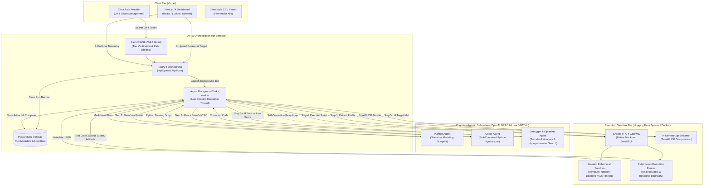
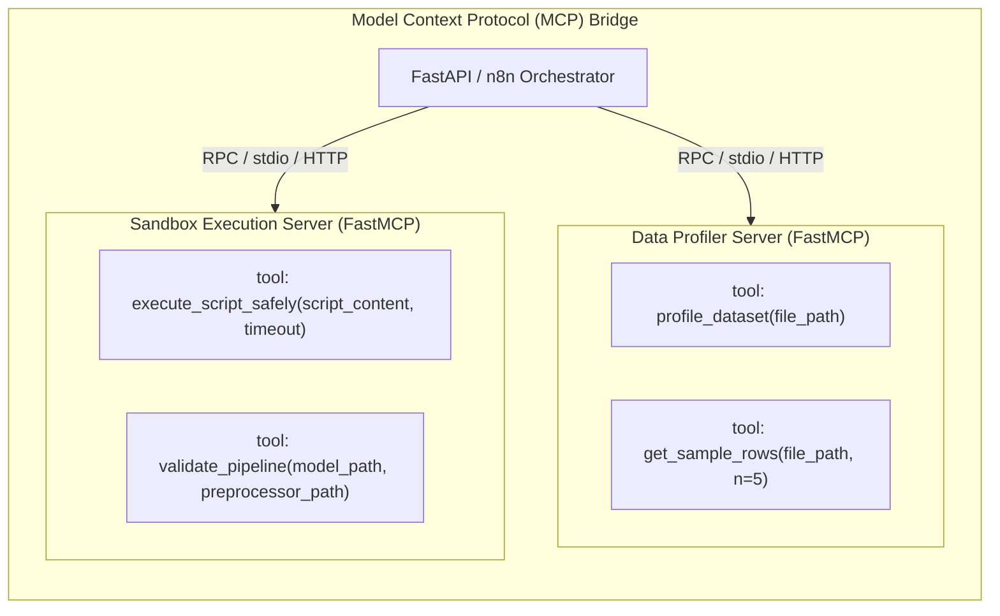
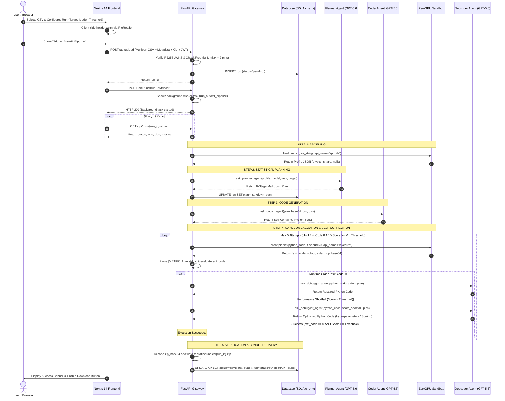

# AutoML: Agentic Model Training & Optimization Platform
## Module 1: Comprehensive Core Product Architecture & Technical Blueprint

---

### Executive Overview

**AutoML** is an enterprise-grade, autonomous machine learning training, debugging, and packaging platform. It replaces traditional manual data science workflows—exploratory data analysis (EDA), data profiling, imputation, feature encoding, scaling, multicollinearity elimination, algorithm selection, hyperparameter search, diagnostic charting, code debugging, and deployment bundle creation—with an autonomous, multi-agent cognitive architecture.

The system compresses a manual 4-to-8 hour data science iteration cycle into an automated, self-correcting pipeline running in **under 3 minutes**, yielding production-ready inference bundles (`model.pkl`, `preprocessor.pkl`, `inference.py`, `requirements.txt`, `training_report.pdf`, and diagnostic plots).

```
┌──────────────────────────────────────────────────────────────────────────────────────────────────┐
│                                       AutoML PLATFORM ECOSYSTEM                                  │
└──────────────────────────────────────────────────────────────────────────────────────────────────┘
                                                    
      [ Next.js 14 + Clerk UI ] ──(JWT Bearer Token)──► [ FastAPI API Gateway ]
                 │                                               │
                 │ (SSE / HTTP Polling)                          ▼
                 ▼                                     [ SQLAlchemy / PostgreSQL ]
      [ Real-time Activity Telemetry ]                           │
                                                                 ▼
                                                    [ Multi-Agent Orchestrator ]
                                                                 │
                   ┌─────────────────────────────────────────────┼────────────────────────────────────────────┐
                   ▼                                             ▼                                            ▼
         [ Profiler Agent / MCP ]                      [ Planner Agent ]                             [ Coder Agent ]
         (FastMCP / Pandas Summary)                  (Statistical Architect)                       (Sklearn Synthesizer)
                   │                                             │                                            │
                   └─────────────────────────────────────────────┼────────────────────────────────────────────┘
                                                                 ▼
                                                [ Hugging Face ZeroGPU / Docker ]
                                                [   Isolated Execution Sandbox  ]
                                                                 │
                                                    ┌────────────┴────────────┐
                                         (Pass)     │                         │ (Fail / Low Score)
                                                    ▼                         ▼
                                          [ Validate & Package ]     [ Debugger Agent ]
                                          (.zip Bundle Generator)    (Self-Correction Loop)
```

---

## 1. High-Level System Architecture

The platform is architected around a **decoupled, event-driven, multi-tier topology** designed for security, deterministic control, cognitive flexibility, and zero-cost cloud scalability.



---

## 2. Core Components Deep Dive

### 2.1. Client Tier (Next.js & Clerk Authentication)
* **Frontend Architecture:** Next.js 14 App Router application deployed on Vercel (`frontend/app/page.js`).
* **Dynamic Client-side Profiling:** When a user selects a dataset, the browser reads the file header using the native `FileReader` API, parses column names, and automatically pre-fills the **Target Variable** selector, setting the default to the last column.
* **Interactive Telemetry Engine:** Employs an asynchronous polling cycle against `/api/runs/{run_id}/status` every 1500ms. Log streams are parsed dynamically for semantic log tags (`[SYSTEM]`, `[AGENT]`, `[OK]`, `[WARN]`, `[ERR]`, `[METRIC]`) and color-coded in real-time.
* **Tier Gating & Modal Integration:** Enforces a strict 2-run free trial limit. When a free-tier user attempts a 3rd execution, the backend rejects the request with HTTP 403 `TRIAL_LIMIT_EXCEEDED`, prompting the client to display an interactive Stripe upgrade modal.

---

### 2.2. API Gateway & Security Tier (`backend/main.py`, `backend/auth.py`)
* **Framework:** FastAPI with asynchronous ASGI request processing and CORS middleware.
* **Authentication Engine:** Implements `HTTPBearer` security validating Clerk JWT tokens signed with **RS256 asymmetric encryption**.
* **JWKS Key Caching:** To minimize latency and avoid DDoS attacks on Clerk's servers, public keys are retrieved from `https://api.clerk.com/v1/jwks` and cached in memory with a 1-hour Time-To-Live (`JWKS_CACHE_TTL = 3600`).
* **Dynamic Key Verification:** The authentication middleware extracts the `kid` (Key ID) header from the incoming unverified JWT, matches it against the cached JWKS public keys, builds an RSA public key object using `jwt.algorithms.RSAAlgorithm.from_jwk`, and decodes the token payload.
* **Database Schema Self-Migration:** On service startup, metadata reflection (`sqlalchemy.inspect`) checks the PostgreSQL/SQLite `runs` table and executes non-destructive dynamic schema patches (`ALTER TABLE runs ADD COLUMN IF NOT EXISTS plan TEXT;`) to eliminate downtime across deployments.

```
Incoming Request ──► Extract Bearer JWT ──► Read 'kid' Header ──► Lookup Cached JWKS Key
                                                                          │
                                                                          ▼
User Context { user_id, tier } ◄── Decode RS256 Payload ◄── RSA Algorithm Verification
```

---

### 2.3. Model Context Protocol (MCP) Layer (`mcp_servers/`)
The platform implements the open **Model Context Protocol (MCP)** using `FastMCP` to standardize agent-tool interactions and decouple data profiling and code execution from the core orchestrator.



#### FastMCP Server Responsibilities:
1. **`profiler_server.py`:**
   - `profile_dataset(file_path)`: Uses `pandas` to extract shape $(N \times M)$, data types, null distributions, numeric column lists, and categorical column lists.
   - `get_sample_rows(file_path, n=5)`: Returns the top $N$ representative rows in JSON format for zero-shot LLM grounding.
2. **`sandbox_server.py`:**
   - `execute_script_safely(script_content, timeout=60)`: Dispatches code to Docker container or local subprocess, enforcing resource ceilings and capturing standard streams.
   - `validate_pipeline(model_path, preprocessor_path)`: Executes a standalone integrity verification script to guarantee `joblib.load()` operates without serialization corruption.
3. **`automl_service.py`:**
   - Exposes standard REST endpoints (`/profile_dataset`, `/execute_script_safely`, `/validate_pipeline`, `/download_bundle`) bridging MCP tool logic to workflow engines like **n8n**.

---

### 2.4. Cognitive Multi-Agent Subsystem (`backend/agents/`)

The cognitive engine uses specialized single-responsibility agents orchestrated sequentially with iterative feedback loops:

```
                  ┌────────────────────────────────────────────────────────┐
                  │                 COGNITIVE MULTI-AGENT PIPELINE         │
                  └────────────────────────────────────────────────────────┘

    ┌──────────────────────────┐      ┌──────────────────────────┐      ┌──────────────────────────┐
    │      PLANNER AGENT       │      │       CODER AGENT        │      │      DEBUGGER AGENT      │
    │  (Statistical Architect) │      │  (Pipeline Synthesizer)  │      │  (Self-Correction Eng.)  │
    ├──────────────────────────┤      ├──────────────────────────┤      ├──────────────────────────┤
    │ Ingests:                 │      │ Ingests:                 │      │ Ingests:                 │
    │ • Dataset Metadata JSON  │ ──►  │ • Markdown Plan          │ ──►  │ • Failed Python Script   │
    │ • Target Column Name     │      │ • Base64 CSV String      │      │ • Traceback (stderr)     │
    │ • Task Type & Model      │      │ • Feature Column Lists   │      │ • Score Shortfall Δ      │
    │ Outputs:                 │      │ Outputs:                 │      │ Outputs:                 │
    │ • 8-Stage Execution Plan │      │ • Raw Standalone Python  │      │ • Repaired / Tuned Script│
    └──────────────────────────┘      └──────────────────────────┘      └──────────────────────────┘
```

#### Agent Specifications:
1. **Planner Agent (`planner.py`):**
   - **Role:** Lead Data Science Architect.
   - **Task:** Formulates an 8-stage statistical modeling plan:
     1. Missing value imputation strategy (mean/median for numeric, mode/constant for categorical).
     2. Feature scaling (`StandardScaler`) and encoding (`OneHotEncoder(handle_unknown='ignore')`).
     3. Multicollinearity diagnostics via **Variance Inflation Factor (VIF > 5.0)** for linear models.
     4. Data partitioning (80/20 train/test split with strict leakage prevention).
     5. Model instantiation and training matching the requested task (Classification vs. Regression).
     6. Metric evaluation (Accuracy/F1-Score or $R^2$/MAE/RMSE).
     7. Diagnostic chart generation (Confusion Matrix heatmap or Residuals histogram).
     8. Serialization of `model.pkl` and `preprocessor.pkl`.

2. **Coder Agent (`coder.py`):**
   - **Role:** Expert Machine Learning Implementation Engineer.
   - **Task:** Generates a 100% self-contained, executable Python script.
   - **Base64 In-Memory Embedding:** Embeds the raw dataset directly into the script as a base64 string:
     ```python
     import base64, io, pandas as pd
     CSV_BASE64 = "..."
     df = pd.read_csv(io.StringIO(base64.b64decode(CSV_BASE64).decode('utf-8')))
     ```
   - **Metric Standard Output Protocol:** Prints validation metrics with a strict parseable prefix:
     `print(f"[METRIC] Accuracy = {acc:.4f}")` or `print(f"[METRIC] R2 Score = {r2:.4f}")`.
   - **Production Artifact Generation:** Generates diagnostic PNG plots, writes a standalone `inference.py`, exports `requirements.txt`, and generates a `README.md`.

3. **Debugger & Optimization Agent (`debugger.py`):**
   - **Role:** Senior Machine Learning Debugging & Optimization Specialist.
   - **Task:** Activates on execution failures or metric shortfalls.
   - **Fault Diagnosis:**
     - *Runtime Exception:* Identifies `KeyError`, `ValueError`, `ShapeMismatch`, or dependency errors and rewrites the script logic.
     - *Performance Shortfall ($Score < Threshold$):* Broadens hyperparameter grids (via `RandomizedSearchCV`), introduces interaction features, or refines scaling strategies.

---

### 2.5. Execution Sandbox Environments

The platform supports two isolated execution runtimes:

```
                                    SANDBOX RUNTIMES
                     ┌──────────────────────┴──────────────────────┐
                     ▼                                             ▼
        [ Hugging Face Spaces (ZeroGPU) ]                 [ Local Docker Container ]
        • Free-tier Cloud GPU/CPU                         • Local Desktop / Enterprise
        • Native Gradio 4+ Blocks API                     • `docker-py` SDK Controller
        • TempDir In-Memory Isolation                     • `--network none` (Air-Gapped)
        • Memory Zip Buffer Streamer                      • `mem_limit="1g"` Hard Quota
```

#### A. Cloud Sandbox: Hugging Face ZeroGPU (`sandbox/app.py`)
* Deployed as a native Gradio application on Hugging Face Spaces.
* Annotated with `@spaces.GPU` for hardware acceleration.
* Script execution occurs inside an isolated `tempfile.TemporaryDirectory()`.
* After execution, the sandbox recursively traverses the temporary directory, compresses all generated `.pkl`, `.png`, `.txt`, `.py`, and `.pdf` files into an in-memory `io.BytesIO()` ZIP stream, base64-encodes the buffer, and returns it directly in the JSON response payload.

#### B. Local Sandbox: Docker-py Isolation (`mcp_servers/sandbox_server.py`)
* Spawns an isolated container (`automl-sandbox:latest`).
* **Air-Gapped Security:** Enforces `network_mode="none"`, blocking all inbound and outbound network connectivity to prevent data exfiltration.
* **Resource Ceiling:** Sets strict memory limits (`mem_limit="1g"`) and execution timeouts (60 seconds) to prevent infinite loops and memory bombing.

---

## 3. End-to-End Data Logic Flow



---

## 4. Engineering Checks and Balances

```
┌──────────────────────────────────────────────────────────────────────────────────────────────────┐
│                                   CHECKS & BALANCES FRAMEWORK                                    │
└──────────────────────────────────────────────────────────────────────────────────────────────────┘

   DATA SCIENCE INTEGRITY               SANDBOX SECURITY                     SYSTEM RELIABILITY
  ────────────────────────             ──────────────────                   ────────────────────
  • Strict 80/20 Train/Test Split      • Subprocess / Container Isolation   • Schema Type-Safety Monkey Patch
  • Pipeline Fit on Train Only         • Air-Gapped Network (Docker)        • RS256 JWKS Key Caching
  • Dynamic VIF Multicollinearity      • 60s Subprocess Execution Ceiling   • Universal UTF-8 Stream Normalization
  • Robust Missing Value Imputation    • Ephemeral TempDir Auto-Scrubbing   • Dynamic Schema Self-Migration
```

### 4.1. Data Science & Statistical Integrity
1. **Zero Data Leakage Protocol:** 
   - All transformations (`StandardScaler`, `OneHotEncoder`, `SimpleImputer`) are wrapped inside an `sklearn.compose.ColumnTransformer` and fit **exclusively on the training partition** ($X_{train}$).
   - The test partition ($X_{test}$) is strictly transformed using the fitted parameters to guarantee realistic evaluation metrics.
2. **Multicollinearity Suppression (VIF Calculation):**
   - For linear models (Linear Regression, Logistic Regression), high feature collinearity causes unstable coefficient estimation and inflated variance.
   - The Coder Agent implements a native Variance Inflation Factor calculation loop:
     $$\text{VIF}_i = \frac{1}{1 - R_i^2}$$
   - Any feature displaying $\text{VIF} > 5.0$ is automatically pruned prior to model fitting without requiring heavy external dependencies like `statsmodels`.
3. **Target Variable Separation:**
   - The target variable is systematically purged from feature processing arrays prior to pipeline assembly, preventing target leakage.
4. **Categorical Unknown Handling:**
   - All categorical encoders are instantiated with `handle_unknown='ignore'`, preventing runtime inference crashes when encountering unseen categories in production.

---

### 4.2. Security & Sandboxing Guardrails
1. **Remote Code Execution (RCE) Defense-in-Depth:**
   - Dynamically generated code is never executed directly inside the host API process.
   - In Docker mode, containers execute with `network_mode="none"`, `mem_limit="1g"`, and read-only host mounts.
2. **Deterministic Timeouts:**
   - Execution subprocesses are bounded by a hard `timeout=60` second parameter. If a script enters an infinite loop or performs excessive grid searches, `subprocess.TimeoutExpired` terminates the process and routes the event to the Debugger Agent.
3. **Ephemeral Storage Cleansing:**
   - Sandbox runs occur in temporary directories (`tempfile.TemporaryDirectory()`) that are purged from disk immediately upon completion or exception.

---

### 4.3. Production Reliability & System Edge Cases

#### Incident 1: Gradio Client Schema Parsing Bug (`bool` is not iterable)
* **Root Cause:** In newer Pydantic versions, Gradio’s schema introspection represented dictionary outputs as `"additionalProperties": true`. The `gradio_client` introspector attempted `if "const" in schema:`, which threw a `TypeError: argument of type 'bool' is not iterable` when evaluating a boolean.
* **Architectural Fix:**
  1. Converted all Gradio endpoints from `gr.JSON` to flat `gr.Textbox` strings returning serialized JSON.
  2. Applied an in-memory monkey patch to `gradio_client.utils.get_type` across both sandbox and orchestrator:
     ```python
     import gradio_client.utils
     orig_get_type = gradio_client.utils.get_type
     def patched_get_type(schema):
         if isinstance(schema, bool):
             return "boolean"
         return orig_get_type(schema)
     gradio_client.utils.get_type = patched_get_type
     ```

#### Incident 2: ZeroGPU AST Static Detection Bypass
* **Root Cause:** Launching Gradio via a custom FastAPI wrapper (`gr.mount_gradio_app` + `uvicorn.run`) bypassed Hugging Face’s static Abstract Syntax Tree (AST) analyzer, triggering the error: `No @spaces.GPU function detected during startup`.
* **Architectural Fix:**
  - Refactored `sandbox/app.py` into a native Gradio application using `gr.Blocks()`, declaring `@spaces.GPU` directly on event functions and launching via `demo.launch()`. Gradio automatically exposes `/api/profile` and `/api/execute` without custom web frameworks.

#### Incident 3: Windows Unicode Stream Crashes
* **Root Cause:** Standard terminal streams on Windows environments defaulted to `cp1252`, crashing when logging Unicode emojis and formatting tags.
* **Architectural Fix:** Reconfigured `sys.stdout` and `sys.stderr` to enforce `utf-8` encoding at module boot:
  ```python
  if sys.stdout.encoding != 'utf-8':
      sys.stdout.reconfigure(encoding='utf-8')
  ```

---

## 5. Artifact Packaging Specification

Upon successful training, the platform compiles a standalone production inference archive (`static/bundles/{run_id}.zip`):

```
automl_bundle_{run_id}.zip
├── model.pkl                  # Serialized trained Scikit-Learn / XGBoost estimator
├── preprocessor.pkl           # Fitted ColumnTransformer (scaling, encoding, imputation)
├── inference.py               # Standalone production prediction service
├── requirements.txt           # Explicit Python dependencies with pinned versions
├── README.md                  # Integration & quickstart documentation
├── confusion_matrix.png       # Classification diagnostic heatmap (or residuals.png)
├── feature_importances.png    # Top predictive feature weight visualization
└── training_report.pdf        # Formal executive summary report
```

### Standalone `inference.py` Contract:
```python
import joblib
import pandas as pd

def predict(input_data: pd.DataFrame):
    """
    Production-ready prediction function.
    Loads fitted preprocessor and model from local directory.
    """
    preprocessor = joblib.load("preprocessor.pkl")
    model = joblib.load("model.pkl")
    
    transformed_data = preprocessor.transform(input_data)
    predictions = model.predict(transformed_data)
    return predictions
```

---

## 6. Database Schema & Data Model (`backend/models.py`)

The metadata repository uses a single unified entity schema (`runs` table) compatible with SQLite (local development) and PostgreSQL (production):

```sql
CREATE TABLE IF NOT EXISTS runs (
    id VARCHAR(36) PRIMARY KEY,
    created_at TIMESTAMP WITH TIME ZONE DEFAULT CURRENT_TIMESTAMP,
    dataset_name VARCHAR(255) NOT NULL,
    target_variable VARCHAR(255) NOT NULL,
    task_type VARCHAR(50) NOT NULL,
    selected_model VARCHAR(100),
    min_threshold FLOAT,
    status VARCHAR(50) DEFAULT 'pending',
    metrics JSON DEFAULT '{}',
    logs JSON DEFAULT '[]',
    bundle_url VARCHAR(512),
    plan TEXT,
    user_id VARCHAR(100)
);

CREATE INDEX IF NOT EXISTS ix_runs_user_id ON runs (user_id);
```

| Field Name | Type | Description |
| :--- | :--- | :--- |
| `id` | `VARCHAR(36)` | UUIDv4 Primary Key. |
| `dataset_name` | `VARCHAR(255)` | Original uploaded filename. |
| `target_variable`| `VARCHAR(255)` | Supervised target column name. |
| `task_type` | `VARCHAR(50)` | `classification` or `regression`. |
| `selected_model` | `VARCHAR(100)` | Requested algorithm (e.g. Random Forest, XGBoost). |
| `min_threshold` | `FLOAT` | Target validation performance threshold (e.g. 0.90). |
| `status` | `VARCHAR(50)` | `pending` $\rightarrow$ `profiling` $\rightarrow$ `planning` $\rightarrow$ `generating` $\rightarrow$ `training` $\rightarrow$ `verifying` $\rightarrow$ `complete` / `failed`. |
| `metrics` | `JSON` | Extracted validation metrics dictionary (`{"accuracy": 0.945, "f1_score": 0.941}`). |
| `logs` | `JSON` | Ordered array of timestamped telemetry strings. |
| `plan` | `TEXT` | Full Markdown plan generated by Planner Agent. |
| `bundle_url` | `VARCHAR(512)` | Relative download URI for the generated ZIP archive. |
| `user_id` | `VARCHAR(100)` | Clerk User Subject Identifier (`sub`) for multi-tenant isolation. |

---

## 7. Performance & Operational Metrics

| Metric Dimension | Manual Data Science Workflow | AutoML Agentic Platform | Improvement Factor |
| :--- | :--- | :--- | :--- |
| **Pipeline Creation Latency** | 4 to 8 hours | **< 3 minutes** (140 - 180 sec) | **~100x Acceleration** |
| **Code Debugging Cycle** | 15 to 45 min per error | **10 to 15 seconds** per self-correction loop | **~60x Faster Recovery** |
| **Infrastructure Cost** | \$50–\$200/mo cloud VM | **\$0.00 / month** (Render + HF ZeroGPU + Vercel) | **Zero-Cost Free Tier** |
| **Inference Packaging** | Manual scripting & testing | **Automated Zip Streamer** (1-click download) | **Deterministic & Error-Free** |
| **Security Isolation** | Local environment execution | **Air-Gapped Docker / Ephemeral Cloud Sandbox** | **Zero Host RCE Exposure** |
