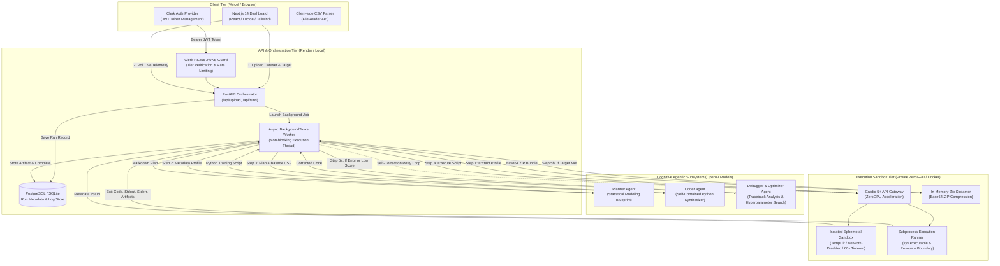
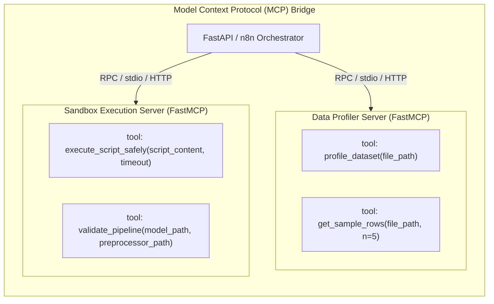

# ⚡ AutoML: Autonomous Agentic ML Training & Optimization Platform

[](https://www.python.org/)
[](https://fastapi.tiangolo.com/)
[](https://nextjs.org/)
[](https://modelcontextprotocol.io/)
[](https://huggingface.co/)
[](https://www.docker.com/)
[](LICENSE)

> **Ship production-grade machine learning models without writing the pipeline.**  
> AutoML is an enterprise-grade, multi-agent cognitive platform that replaces manual data science iteration cycles with an autonomous, self-healing execution loop. Point it at any structured CSV or Excel dataset, define your target column, and the multi-agent engine profiles the schema, plans statistical safeguards, synthesizes executable Scikit-Learn code, runs it inside an isolated sandbox, self-corrects on failure, and packages a deployment-ready inference bundle — running end-to-end in **under 3 minutes**.

---

## 📑 Table of Contents

- [Executive Overview](#-executive-overview)
- [Key Features](#-key-features)
- [System Architecture](#-system-architecture)
- [Multi-Agent Cognitive Engine](#-multi-agent-cognitive-engine)
- [Dual Sandbox Execution Environments](#-dual-sandbox-execution-environments)
- [Model Context Protocol (MCP) & n8n Integration](#-model-context-protocol-mcp--n8n-integration)
- [Production Inference Deliverables](#-production-inference-deliverables)
- [Security, Privacy & Sandboxing Guardrails](#-security-privacy--sandboxing-guardrails)
- [Repository Structure](#-repository-structure)
- [Quickstart & Installation](#-quickstart--installation)
  - [Prerequisites](#prerequisites)
  - [Environment Variables Setup](#environment-variables-setup)
  - [1. Backend API Gateway](#1-backend-api-gateway)
  - [2. Next.js 14 Dashboard](#2-nextjs-14-dashboard)
  - [3. Execution Sandbox Options](#3-execution-sandbox-options)
- [API Reference](#-api-reference)
- [Supported Machine Learning Algorithms](#-supported-machine-learning-algorithms)
- [Testing & Quality Assurance](#-testing--quality-assurance)
- [License](#-license)

---

## 🚀 Executive Overview

Traditional machine learning model development requires hours of manual glue work: exploratory profiling, missing-value imputation, categorical encoding, multicollinearity pruning, algorithm selection, hyperparameter tuning, debugging syntax crashes, and writing standalone prediction wrappers.

**AutoML compresses this 4–8 hour manual workflow into an automated, deterministic pipeline in < 180 seconds:**

```
┌──────────────────────────────────────────────────────────────────────────────────────────────────┐
│                                       AutoML PLATFORM ECOSYSTEM                                  │
└──────────────────────────────────────────────────────────────────────────────────────────────────┘
                                                    
      [ Next.js 14 + Clerk UI ] ──(JWT Bearer Token)──► [ FastAPI API Gateway ]
                 │                                               │
                 │ (Live Telemetry Polling)                      ▼
                 ▼                                     [ SQLAlchemy / PostgreSQL ]
      [ Real-time Activity Telemetry ]                           │
                                                                 ▼
                                                    [ Multi-Agent Orchestrator ]
                                                                 │
                   ┌─────────────────────────────────────────────┼────────────────────────────────────────────┐
                   ▼                                             ▼                                            ▼
         [ Profiler Agent / MCP ]                      [ Planner Agent ]                             [ Coder Agent ]
         (FastMCP / Pandas Summary)                  (Statistical Architect)                       (Sklearn Synthesizer)
                   │                                             │                                            │
                   └─────────────────────────────────────────────┼────────────────────────────────────────────┘
                                                                 ▼
                                                [ Hugging Face ZeroGPU / Docker ]
                                                [   Isolated Execution Sandbox  ]
                                                                 │
                                                    ┌────────────┴────────────┐
                                         (Pass)     │                         │ (Fail / Low Score)
                                                    ▼                         ▼
                                          [ Validate & Package ]     [ Debugger Agent ]
                                          (.zip Bundle Generator)    (Self-Correction Loop)
```

---

## ✨ Key Features

- 🧠 **Autonomous Multi-Agent Architecture:** Three specialized cognitive agents (**Planner**, **Coder**, **Debugger & Optimizer**) divide cognitive load and eliminate hallucinations.
- 🔄 **Autonomous Self-Correction Loop:** When execution encounters a runtime crash (`exit_code != 0`) or falls short of the target validation score ($Score < Threshold$), the Debugger Agent analyzes tracebacks and iteratively repairs or tunes the code up to 5 attempts.
- 🛡️ **Zero Data Leakage & Statistical Rigor:** All imputers, encoders (`handle_unknown='ignore'`), and scalers fit strictly on $X_{train}$. Dynamic **Variance Inflation Factor (VIF > 5.0)** calculation automatically prunes multicollinear features for linear estimators without heavy external dependencies.
- 🔒 **Dual-Mode Secure Sandboxing:**
  - **Cloud:** Ephemeral ZeroGPU runners on Hugging Face Spaces via native Gradio Blocks API with token authentication.
  - **Local:** Air-gapped (`network_mode="none"`), hard-quota (`mem_limit="1g"`), 60-second bounded Docker containers.
- 🔌 **Model Context Protocol (MCP) Native:** Integrates `FastMCP` servers exposing data profiling and sandboxed script execution as standardized JSON-RPC tools for LLM agents or low-code workflow engines like **n8n**.
- 📦 **1-Click Inference Deliverables:** Compiles a production-ready `.zip` bundle containing `model.pkl`, `preprocessor.pkl`, standalone `inference.py`, pinned `requirements.txt`, diagnostic visualizations, and an executive PDF report.
- 🔐 **Enterprise Auth & Quota Guardrails:** Asymmetric **Clerk RS256 JWKS** token authentication with 1-hour in-memory key caching and tier-gated execution limits.
- 📊 **Multi-Interface Support:** Includes a cyber-futuristic Next.js 14 web app, Streamlit interactive dashboards, and standalone REST/MCP APIs.

---

## 🏛️ System Architecture



---

## 🤖 Multi-Agent Cognitive Engine

Rather than relying on a single monolithic prompt, AutoML divides cognition across three specialized agents located in `backend/agents/`:

```
                  ┌────────────────────────────────────────────────────────┐
                  │                 COGNITIVE MULTI-AGENT PIPELINE         │
                  └────────────────────────────────────────────────────────┘

    ┌──────────────────────────┐      ┌──────────────────────────┐      ┌──────────────────────────┐
    │      PLANNER AGENT       │      │       CODER AGENT        │      │      DEBUGGER AGENT      │
    │  (Statistical Architect) │      │  (Pipeline Synthesizer)  │      │  (Self-Correction Eng.)  │
    ├──────────────────────────┤      ├──────────────────────────┤      ├──────────────────────────┤
    │ Ingests:                 │      │ Ingests:                 │      │ Ingests:                 │
    │ • Dataset Metadata JSON  │ ──►  │ • Markdown Plan          │ ──►  │ • Failed Python Script   │
    │ • Target Column Name     │      │ • Base64 CSV String      │      │ • Traceback (stderr)     │
    │ • Task Type & Model      │      │ • Feature Column Lists   │      │ • Score Shortfall Δ      │
    │ Outputs:                 │      │ Outputs:                 │      │ Outputs:                 │
    │ • 8-Stage Execution Plan │      │ • Raw Standalone Python  │      │ • Repaired / Tuned Script│
    └──────────────────────────┘      └──────────────────────────┘      └──────────────────────────┘
```

### 1. Planner Agent (`planner.py`)
Acts as the Lead Data Science Architect. Ingests raw schema metadata (row count, feature data types, null distributions, categorical cardinalities) and formulates an **8-Stage Statistical Execution Plan**:
1. Missing value imputation strategies (mean/median for numerical, mode for categorical).
2. Scaling (`StandardScaler`) and encoding (`OneHotEncoder(handle_unknown='ignore')`).
3. Multicollinearity suppression: VIF loop for linear models.
4. Leakage-free 80/20 train/test data partitioning.
5. Model instantiation and training matching the requested task.
6. Metric evaluation (Accuracy, F1-Score for classification; $R^2$, MAE, RMSE for regression).
7. Diagnostic plot generation (`confusion_matrix.png`, `residuals.png`, `feature_importances.png`).
8. Artifact serialization (`model.pkl`, `preprocessor.pkl`, `inference.py`, `requirements.txt`).

### 2. Coder Agent (`coder.py`)
Translates the Markdown plan into an immediately executable, self-contained Python script:
- Embeds the dataset in-memory as a Base64-encoded string (`base64.b64decode()`), eliminating external disk dependencies during remote sandbox execution.
- Emits real-time telemetry via structured stdout parsing (`[METRIC] Accuracy = 0.9450`).
- Generates clean artifact files and production prediction code.

### 3. Debugger & Optimization Agent (`debugger.py`)
Activates when the sandbox returns a non-zero exit code or fails to achieve `min_threshold`:
- **Syntax/Runtime Crashes:** Ingests Python traceback (`stderr`), isolates missing imports or shape mismatches, and rewrites the pipeline.
- **Metric Optimization:** When score is below threshold, dynamically injects hyperparameter exploration (`RandomizedSearchCV`), introduces interaction terms, or tunes regularization penalties.

---

## 🔒 Dual Sandbox Execution Environments

| Dimension | Cloud Sandbox (Hugging Face Spaces) | Local Docker Sandbox (`docker-py`) |
| :--- | :--- | :--- |
| **Location** | `sandbox/app.py` | `mcp_servers/sandbox_server.py` |
| **Hardware** | ZeroGPU (`@spaces.GPU`) / CPU | Local Host CPU / GPU |
| **Protocol** | Native Gradio Blocks Client (`/profile`, `/execute`) | FastMCP JSON-RPC / Subprocess |
| **Security** | Private Space + Token Auth, Ephemeral `tempfile` | Air-Gapped (`network_mode="none"`), Read-only volumes |
| **Resource Cap**| Space Quotas & Timeouts | Hard 1GB RAM (`mem_limit="1g"`), 60s Subprocess Ceiling |
| **Artifact Delivery** | Base64-encoded In-Memory ZIP Buffer | Direct Host Volume Mount (`/workspace/host_dir`) |

---

## 🔌 Model Context Protocol (MCP) & n8n Integration

AutoML adheres to the open **Model Context Protocol (MCP)** using `FastMCP`, standardizing AI agent-to-tool communication:



### 1. Profiler Server (`mcp_servers/profiler_server.py`):
- `profile_dataset(file_path)`: Scans shape, data types, missing rates, and column distributions.
- `get_sample_rows(file_path, n=5)`: Extracts top sample rows for zero-shot LLM context grounding.

### 2. Sandbox Server (`mcp_servers/sandbox_server.py`):
- `execute_script_safely(script_content, timeout=60)`: Executes the Python training script inside Docker or isolated subprocess with path mapping.
- `validate_pipeline(model_path, preprocessor_path)`: Validates that `joblib.load()` succeeds and that `predict()` operates without serialization degradation.

### 3. n8n Low-Code Orchestration (`n8n/automl_workflow.json`):
Provides a visual workflow where Webhook triggers pass CSV data through the Profiler and Sandbox MCP tools, executing full pipeline cycles visually.

---

## 📦 Production Inference Deliverables

Every successful run outputs an in-memory ZIP package (`automl_bundle_{run_id}.zip`):

```
automl_bundle_{run_id}.zip
├── model.pkl                  # Serialized trained Scikit-Learn / XGBoost estimator
├── preprocessor.pkl           # Fitted ColumnTransformer (scaling, encoding, imputation)
├── inference.py               # Standalone production prediction service
├── requirements.txt           # Explicit Python dependencies with pinned versions
├── README.md                  # Model card, validation metrics & quickstart guide
├── confusion_matrix.png       # Classification diagnostic heatmap (or residuals.png)
├── feature_importances.png    # Top predictive feature weight visualization
└── training_report.pdf        # Formal PDF executive summary report
```

### Zero-Friction Prediction Interface (`inference.py`):
```python
import joblib
import pandas as pd

def predict(input_data: pd.DataFrame):
    """
    Production-ready prediction function.
    Loads fitted preprocessor and model from local directory.
    """
    preprocessor = joblib.load("preprocessor.pkl")
    model = joblib.load("model.pkl")
    
    transformed_data = preprocessor.transform(input_data)
    predictions = model.predict(transformed_data)
    return predictions
```

---

## 🛡️ Security, Privacy & Sandboxing Guardrails

```
┌──────────────────────────────────────────────────────────────────────────────────────────────────┐
│                                   CHECKS & BALANCES FRAMEWORK                                    │
└──────────────────────────────────────────────────────────────────────────────────────────────────┘

   DATA PRIVACY & CREDENTIALS           SANDBOX ISOLATION                    DATA SCIENCE RIGOR
  ─────────────────────────────        ──────────────────                   ────────────────────
  • Zero hardcoded keys or URLs        • Subprocess / Container Isolation   • Strict 80/20 Train/Test Split
  • Private Space + Fine-Grained Token • Air-Gapped Network (Docker)        • Pipeline Fit on Train Only
  • Local .env ignored in Git          • 60s Subprocess Execution Ceiling   • Dynamic VIF Multicollinearity
  • Databases (*.db) Git-ignored       • Ephemeral TempDir Auto-Scrubbing   • Robust Missing Value Imputation
```

1. **Zero Hardcoded Secrets or Infrastructure Identifiers:**  
   No API keys, database connection strings, personal usernames, ngrok endpoints, or public space links are stored in the codebase. All connection strings are strictly injected via runtime environment variables.
2. **Private Sandbox Space Protection:**  
   The remote execution engine runs in a **Private** Hugging Face Space. Requests are authenticated via a Fine-grained `HF_TOKEN` with read-only access to prevent unauthorized arbitrary code execution or GPU quota drainage.
3. **Air-Gapped Docker Execution:**  
   When running locally, Docker executes with `network_mode="none"` and `mem_limit="1g"`. Untrusted generated code has zero outbound network access and cannot exfiltrate data.
4. **Multicollinearity Suppression via Native VIF:**  
   $$\text{VIF}_i = \frac{1}{1 - R_i^2}$$
   Features exhibiting $\text{VIF} > 5.0$ are dynamically pruned prior to fitting linear models, eliminating numerical instability without heavy external dependencies.
5. **Universal UTF-8 Stream Normalization:**  
   Forces `sys.stdout` and `sys.stderr` to `utf-8` on process boot, preventing terminal encoding crashes on Windows and Linux alike.

---

## 📁 Repository Structure

```
AutoML/
├── backend/                        # FastAPI Orchestrator & Multi-Agent Core
│   ├── agents/                     # LLM Cognitive Agents
│   │   ├── config.py               # OpenAI client configuration & model settings
│   │   ├── planner.py              # Statistical Architect Agent (8-stage plan)
│   │   ├── coder.py                # Standalone Scikit-Learn Pipeline Synthesizer
│   │   └── debugger.py             # Traceback Analysis & Optimization Specialist
│   ├── db/                         # Database connection & session factory
│   │   └── database.py             # SQLAlchemy engine setup (SQLite / PostgreSQL)
│   ├── auth.py                     # Clerk RS256 JWKS verification & tier-gating
│   ├── main.py                     # API Gateway endpoints (/api/upload, /api/runs)
│   ├── models.py                   # SQLAlchemy schema (AutoMLRun data model)
│   ├── orchestrator.py             # Async worker pipeline & self-correction loop
│   ├── Dockerfile                  # Backend container build specification
│   └── requirements.txt            # Python dependencies for API Gateway
│
├── frontend/                       # Next.js 14 Web Application
│   ├── app/                        # App Router
│   │   ├── globals.css             # Design tokens & cyber-futuristic styling
│   │   ├── layout.js               # Root layout with ClerkAuthProvider wrapper
│   │   └── page.js                 # Interactive dashboard, file drop & telemetry terminal
│   ├── middleware.js               # Clerk authentication route protection
│   └── package.json                # React 18, Lucide, Clerk Next.js dependencies
│
├── sandbox/                        # Hugging Face Spaces ZeroGPU Runner
│   ├── app.py                      # Gradio 5+ Blocks app with @spaces.GPU
│   ├── requirements.txt            # Scikit-learn, XGBoost, LightGBM, CatBoost, ReportLab
│   └── README.md                   # Hugging Face Space metadata configuration
│
├── mcp_servers/                    # Model Context Protocol (MCP) Tool Servers
│   ├── profiler_server.py          # FastMCP Data Profiler tool
│   ├── sandbox_server.py           # FastMCP Docker / Subprocess Sandbox Runner
│   └── automl_service.py           # Unified REST / FastMCP service bridge
│
├── n8n/                            # Workflow Automation
│   └── automl_workflow.json        # Exported n8n visual agent workflow
│
├── tests/                          # Automated Pytest Suite
│   └── test_core_pipeline.py       # Profiler, Sandbox execution & validation tests
│
├── app.py                          # Streamlit UI (n8n Webhook client)
├── app3.py                         # Streamlit Cyberpunk Dashboard (Alternative UI)
├── inference.py                    # Root sample inference module
├── sample_dataset.csv              # Verification dataset
└── README.md                       # Comprehensive Product Documentation
```

---

## 🛠️ Quickstart & Installation

### Prerequisites

- **Python 3.10+**
- **Node.js 18+** & **npm**
- **Docker** (optional, for local air-gapped sandboxing)
- **OpenAI API Key** (access to `gpt-4o` or compatible models)
- **Clerk Account** (for authentication and JWT token management)

### Environment Variables Setup

Create a `.env` file in the project root (or separate `.env` files inside `backend/` and `frontend/`).  
Use the template below, replacing the placeholder values with your own credentials:

```bash
# ── Backend Configuration ───────────────────────────────────────────────────
OPENAI_API_KEY="<your-openai-api-key>"
CLERK_SECRET_KEY="<your-clerk-secret-key>"
DATABASE_URL="<your-database-url>"  # e.g. sqlite:///./local.db or postgresql://<user>:<password>@<host>:5432/<dbname>
HF_SANDBOX_URL="<your-hf-username>/<your-space-name>"
HF_TOKEN="<your-fine-grained-read-token>"  # Required for Private Hugging Face Spaces

# ── Frontend Configuration ──────────────────────────────────────────────────
NEXT_PUBLIC_CLERK_PUBLISHABLE_KEY="<your-clerk-publishable-key>"
CLERK_SECRET_KEY="<your-clerk-secret-key>"
NEXT_PUBLIC_API_URL="<your-backend-api-url>"  # e.g. http://localhost:8000 for local dev
NEXT_PUBLIC_STRIPE_PAYMENT_LINK="<your-stripe-checkout-url>"  # Optional
```

> [!WARNING]
> **Security Guardrail:**  
> Never commit `.env` files or hardcode real credentials in git. The repository's [`.gitignore`](file:///c:/Users/KIIT/Desktop/AutoML/.gitignore) is pre-configured to exclude all `.env`, `.env.*`, and database (`*.db`, `*.sqlite`) files from tracking.

---

### 1. Backend API Gateway

```bash
# 1. Navigate to backend directory
cd backend

# 2. Create and activate virtual environment
python -m venv .venv
source .venv/bin/activate  # On Windows: .venv\Scripts\activate

# 3. Install dependencies
pip install -r requirements.txt

# 4. Start the FastAPI orchestrator
uvicorn backend.main:app --host 0.0.0.0 --port 8000 --reload
```
Interactive OpenAPI/Swagger documentation is available at `http://localhost:8000/docs`.

---

### 2. Next.js 14 Dashboard

```bash
# 1. Navigate to frontend directory
cd frontend

# 2. Install dependencies
npm install

# 3. Launch development server
npm run dev
```
Open `http://localhost:3000` in your browser to access the AutoML Operator Dashboard.

---

### 3. Execution Sandbox Options

#### Option A: Hugging Face Spaces (Default Cloud ZeroGPU)
1. Create a new Space on Hugging Face configured with **Gradio SDK 5.9+** and **ZeroGPU**.
2. Deploy the files from [`sandbox/`](file:///c:/Users/KIIT/Desktop/AutoML/sandbox/) (`app.py`, `requirements.txt`).
3. Set Space visibility to **Private** in Space Settings.
4. Create a **Fine-grained Access Token** with **Read-Only** permissions scoped to that Space, and supply it via `HF_TOKEN` in your backend `.env`.

#### Option B: Local Air-Gapped Docker Sandbox
```bash
# Build the sandbox Docker image
docker build -t automl-sandbox:latest -f sandbox/Dockerfile .

# Start the FastMCP Sandbox Server
python -m mcp_servers.sandbox_server
```

---

## 📡 API Reference

### `POST /api/upload`
Uploads a dataset and initializes a pending training run record.
- **Headers:** `Authorization: Bearer <clerk_jwt>`
- **Form Data:**
  - `file`: CSV or Excel binary file
  - `target_variable`: Target column name to predict
  - `task_type`: `classification` | `regression`
  - `selected_model`: Algorithm selection (e.g., `Random Forest`, `XGBoost`)
  - `min_threshold`: Minimum metric requirement (e.g., `0.90`)
- **Response:**
  ```json
  {
    "run_id": "8fa21db9-9f72-46fa-bb26-ec4830154bc3",
    "dataset_name": "sample_dataset.csv",
    "status": "pending",
    "message": "Dataset uploaded and run initialized successfully."
  }
  ```

### `POST /api/runs/{run_id}/trigger`
Triggers the multi-agent execution pipeline asynchronously in a background worker task.
- **Headers:** `Authorization: Bearer <clerk_jwt>`
- **Response:** `{"message": "AutoML pipeline execution triggered in the background."}`

### `GET /api/runs/{run_id}/status`
Polls live telemetry logs, agent phase transitions, statistical plan, evaluation metrics, and artifact bundle URL.
- **Headers:** `Authorization: Bearer <clerk_jwt>`
- **Response:**
  ```json
  {
    "run_id": "8fa21db9-9f72-46fa-bb26-ec4830154bc3",
    "status": "complete",
    "metrics": {
      "accuracy": 0.9450,
      "f1_score": 0.9412
    },
    "plan": "# 8-Stage Statistical Plan...",
    "bundle_url": "/static/bundles/8fa21db9-9f72-46fa-bb26-ec4830154bc3.zip",
    "logs": [
      "[12:00:01] [SYSTEM] Run initialized.",
      "[12:00:03] [AGENT] Generating statistical pipeline plan...",
      "[12:00:15] [OK] Model training script passed validation."
    ]
  }
  ```

### `GET /api/runs`
Lists all historical model training runs for the authenticated user.

---

## 🗺️ Supported Machine Learning Algorithms

### Classification
- Logistic Regression
- Decision Tree Classifier
- Random Forest Classifier
- XGBoost (`XGBClassifier`)
- LightGBM (`LGBMClassifier`)
- CatBoost (`CatBoostClassifier`)
- Support Vector Machine (`SVC`)
- K-Nearest Neighbors (`KNeighborsClassifier`)
- Gaussian Naive Bayes

### Regression
- Linear Regression / Ridge / Lasso
- Decision Tree Regressor
- Random Forest Regressor
- XGBoost (`XGBRegressor`)
- LightGBM (`LGBMRegressor`)
- CatBoost (`CatBoostRegressor`)
- Support Vector Regressor (`SVR`)
- K-Nearest Neighbors Regressor (`KNeighborsRegressor`)

---

## 🧪 Testing & Quality Assurance

Run the automated test suite to verify the MCP data profiler and sandbox execution loops:

```bash
python -m pytest tests/test_core_pipeline.py -v
```

All test runs execute inside isolated temporary directories with automated artifact cleanup.

---

---

<p align="center">
  Built with ❤️ for Data Scientists, Machine Learning Engineers, and Autonomous AI Enthusiasts.
</p>
