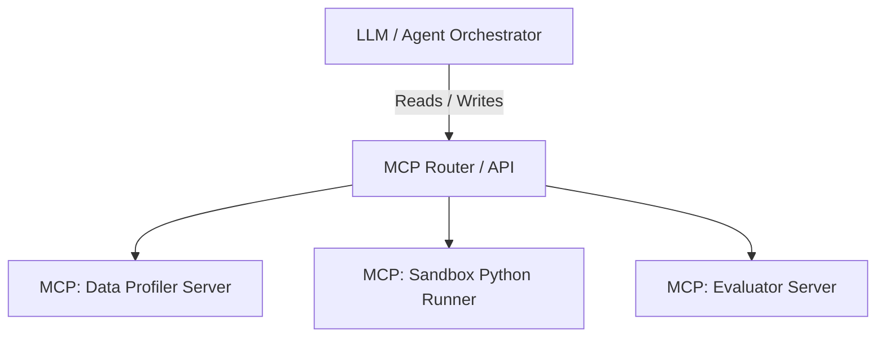
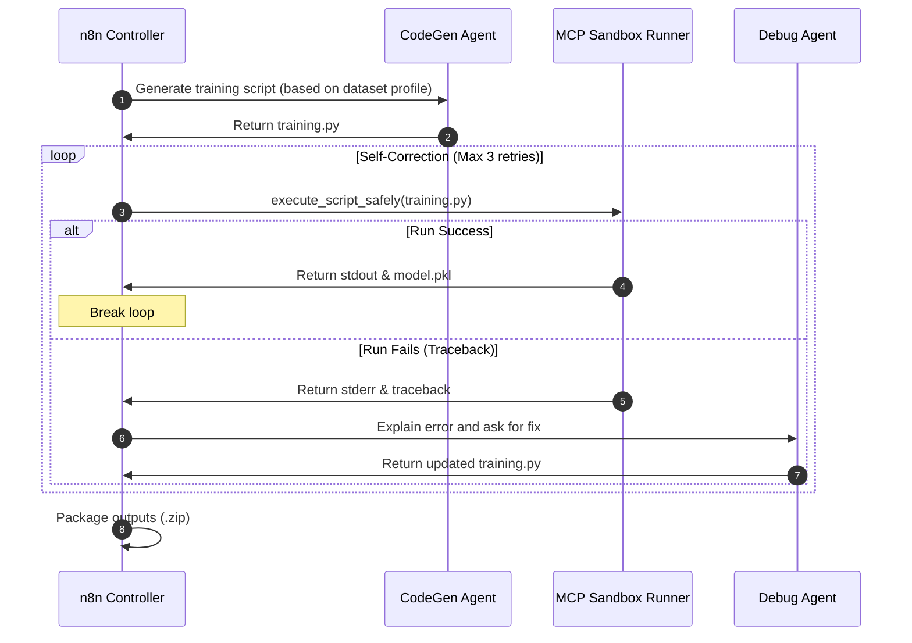

# Architectural Study: Agentic AutoML Core Engine

This document provides a holistic architectural blueprint for building the core engine of the **Agentic AutoML** platform. The objective is to design a system that takes a raw dataset and a user-defined prediction goal, runs a secure, self-correcting agentic workflow, and outputs a production-ready, fully tested inference bundle.

---

## 1. Orchestration Engine: CrewAI vs. n8n

To build a reliable system, we need to balance **agentic flexibility** (creative reasoning, writing code, debugging) with **deterministic control** (fixed pipelines, strict steps, reliable file handling).

| Dimension | CrewAI (Code-First Agents) | n8n (Visual/Deterministic Workflows) |
| :--- | :--- | :--- |
| **Control Flow** | Dynamic, LLM-orchestrated (higher chance of hallucination/loops). | Deterministic DAG (Directed Acyclic Graph) with conditional routing. |
| **State Management** | Implicit within agent memories, harder to debug mid-run. | Explicit visual state per execution node; highly auditable. |
| **Error Recovery** | Relies on agents noticing and correcting errors (imperfect). | Built-in node-level retry logic, error branches, and loops. |
| **Developer UX** | Python-based, easy to version control. | Low-code canvas, excellent for rapid prototyping and monitoring. |

### The Verdict: Hybrid Orchestration
For a mission-critical tool like AutoML, **n8n should act as the Backbone controller**, while **CrewAI (or custom lightweight Python agents) should act as the Execution units**. 

* **n8n** manages the state machine (File Upload → Profile Data → Trigger Code Generator Agent → Execute Code in Sandbox → Verify Results → Package).
* **AI Agents** perform the non-deterministic cognitive tasks (e.g., deciding which features to engineer, writing the training script, diagnosing tracebacks).

---

## 2. Model Context Protocol (MCP) Design

Model Context Protocol (MCP) is the ideal standard for exposing custom tools to your LLM-based agents.

### Recommendation: Multiple Focused MCP Servers
Rather than building a single monolithic MCP server, you should build **two specific, decoupled MCP servers**. This isolates security risks and makes scaling easy.

### 1. Data Profiling & Metadata Server
* **Purpose:** Analyzes the uploaded dataset without loading the entire raw file into the LLM context window.
* **Tools exposed:**
  * `profile_dataset(file_path)`: Returns shape, data types, missing values, and target variable distribution.
  * `get_sample_rows(file_path, n=5)`: Safely displays representative rows.

### 2. Sandbox Execution Server (Crucial Security boundary)
* **Purpose:** Safely runs generated Python scripts and returns stdout, stderr, and generated artifacts.
* **Tools exposed:**
  * `execute_script_safely(script_code, timeout)`: Runs the training code inside an ephemeral Docker container or secure sandbox, returning the traceback if it fails.
  * `validate_inference(model_path, pipeline_path)`: Runs a standard test suite on the generated output to check for input-output shape alignment.

---

## 3. The Core Architecture & Self-Correction Loop

The most complex component is the **Sandbox Execution & Self-Correction Loop**. Python training scripts will frequently crash due to package versions, dimensions mismatches, or invalid parameter inputs. The system must automatically debug itself.

---

## 4. Key Security Considerations

1. **Remote Code Execution (RCE):** The user's AI is writing code and executing it. If not isolated, it can read your host environment variables, modify host files, or launch network attacks.
   * *Mitigation:* The Python runner MCP server **must** run scripts inside a container (e.g., using `docker-py` with `--network none` and strict memory limits).
2. **Context Window Management:** Large datasets cannot be fed directly to the LLM. 
   * *Mitigation:* Ensure only the data profile schema, samples, and summary statistics are sent to the LLM. The actual training code loads the dataset locally inside the sandbox.

---

## 5. Phased Roadmap to Success

* [ ] **Phase 1: Local CLI & Sandboxing**
  * Build the Docker-based sandbox execution environment.
  * Build the Data Profiler and Sandbox MCP Servers.
  * Verify that an LLM client can successfully write a basic script, execute it, read an error, fix it, and produce a `.pkl` file.
* [ ] **Phase 4: n8n Integration**
  * Wire the workflow in n8n.
  * Set up n8n loops to handle the self-correction retries.
  * Expose an API endpoint in n8n that takes a file upload path and returns the zipped deployment bundle.
* [ ] **Phase 3: Production/SaaS Wrap**
  * Convert the n8n backend into a user-facing SaaS dashboard.
  * Add storage integration (S3/GCS) for uploaded datasets and output models.
