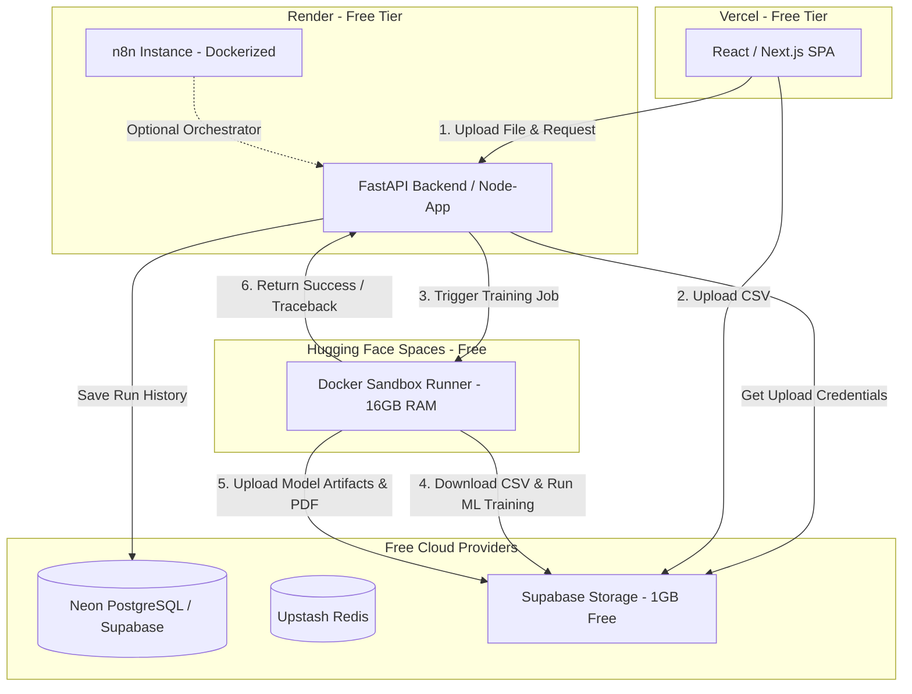

# Zero-Budget Production Deployment Study: Vercel & Render

This study outlines a complete, **$0-cost (Free Tier)** strategy for deploying the Agentic AutoML platform as a high-quality portfolio demonstration. We address the limitations of the free tiers, provide cost-free alternatives for databases/storage, and tackle the critical challenge of executing sandboxed training code on cloud hosts without budget.

---

## 1. The $0-Budget Architecture Stack

To keep the platform 100% free while preserving responsiveness and safety, we distribute the application across multiple cloud providers that offer generous, permanently free tiers:

| Component | Provider | Tier Details | Purpose | Cost |
| :--- | :--- | :--- | :--- | :--- |
| **Frontend** | **Vercel** | Hobby Plan (100GB Bandwidth/mo, 10s Serverless timeout) | Hosts the Next.js/React user interface. | **$0** |
| **Orchestrator Backend** | **Render** | Free Web Services (512MB RAM, shared CPU) | Hosts the API Gateway and orchestration server (FastAPI/Node). | **$0** |
| **Database** | **Neon** or **Supabase** | Free Serverless Postgres (0.5GB - 1GB storage, no expiration) | Stores user records, metadata, model configurations, and run history. | **$0** |
| **Redis Cache / Queue** | **Upstash** | Free Tier (10,000 commands/day) | Provides backplane messaging and event queues if using Celery or n8n. | **$0** |
| **Object Storage** | **Supabase Storage** | Free Tier (1GB storage, 5GB bandwidth/mo) | Stores raw uploaded datasets and generated output model bundles (.zip). | **$0** |
| **Training Sandbox** | **Hugging Face Spaces** | Free Docker Space (2 vCPU, 16GB RAM, 50GB storage) | Executes python training scripts in isolation without crashing due to RAM limits. | **$0** |

---

## 2. Key Challenges & Workarounds on the Free Tier

### Challenge 1: The Render "Cold Start" Spin-Down
Render's free tier web services spin down after **15 minutes of inactivity**. The next request triggers a cold start, taking **50 to 70 seconds** to build/spin up the service.
* **Workaround:** 
  1. Add a visual "spinning up server" loader in the Vercel frontend to manage user expectations.
  2. Use a free monitoring service like **UptimeRobot** or **CronJob.org** to ping the Render backend URL every 14 minutes. This prevents the server from spinning down during active demonstration hours.

### Challenge 2: Render 512MB RAM Limit vs. ML Training
Model training pipelines require substantial memory to parse datasets, run feature engineering, train models, and compute evaluation metrics. Running `pandas`, `xgboost`, and generating PDFs inside a 512MB Render Docker instance will trigger **Out Of Memory (OOM) kills**.
* **Workaround: Hugging Face Spaces (Free Compute Engine)**
  * Create a free Hugging Face Space running a custom Docker container (our [`sandbox_server.py`](file:///c:/Users/KIIT/Desktop/AutoML/mcp_servers/sandbox_server.py) or a FastAPI runner).
  * Hugging Face provides **16 GB of RAM** and **2 vCPUs** on their free container instances.
  * This is perfect for model training and profiling, providing cloud scale compute completely free.

### Challenge 3: Running Docker-in-Docker (DinD) for Sandboxing
Because Render and Hugging Face run inside containerized platforms, we cannot spin up child Docker containers dynamically (no root access to host `/var/run/docker.sock`).
* **Workaround: Ephemeral Script Execution with Sandboxed Python Exec**
  * Instead of trying to spin up Docker-in-Docker, run scripts in a separate restricted python process (`subprocess.run`) on the Hugging Face Docker image. 
  * The Hugging Face space itself is already an isolated container environment. By restricting filesystem permissions and disabling internet access inside the running process, we ensure safety without needing multi-layered Docker.

---

## 3. Step-by-Step Deployment Guide

### Step 1: Prepare the Frontend for Vercel
1. Port the UI logic from Streamlit ([`app.py`](file:///c:/Users/KIIT/Desktop/AutoML/app.py)) into a Next.js single-page application.
2. Store the API endpoints as environment variables (`NEXT_PUBLIC_API_URL`).
3. Deploy to Vercel via GitHub integration.

### Step 2: Set up Supabase / Neon & Upstash
1. Spin up a free PostgreSQL database on Neon or Supabase.
2. Enable a storage bucket on Supabase called `automl-bundles`.
3. Create a free Upstash Redis database and retrieve the connection URL.

### Step 3: Deploy the Backend API on Render
1. Create a `Dockerfile` for the backend API.
2. In the Render Dashboard, create a new **Web Service** pointing to your repository.
3. Inject environment variables for the database URL, S3/Supabase credentials, and the Hugging Face sandbox runner URL.

### Step 4: Deploy the Sandbox Execution Engine on Hugging Face
1. Create a new Space on Hugging Face using the **Docker** SDK.
2. Put the [`sandbox_server.py`](file:///c:/Users/KIIT/Desktop/AutoML/mcp_servers/sandbox_server.py) engine in a FastAPI wrapper.
3. Configure the Space's settings (16GB RAM container is standard for free docker space).
4. Secure it with an API token header so only your Render backend can trigger training runs.
