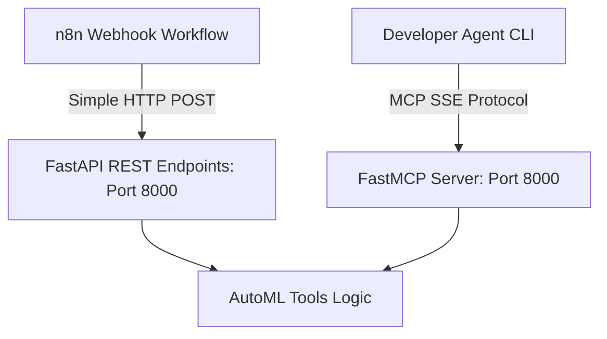

# Root Cause Analysis & Architectural Fix: n8n to MCP Communication

## 1. The Root Cause of the 404 Error

When n8n's **Profile Dataset** HTTP request node called `POST http://host.docker.internal:8000/mcp/tools/profile_dataset`, it received a **404 Not Found** error. 

### Why this happened:
* Model Context Protocol (MCP) servers do **not** expose tools as direct REST API endpoints (like `/mcp/tools/profile_dataset`).
* Instead, MCP is a **JSON-RPC 2.0** protocol. Under the HTTP/SSE transport, the client must perform a handshake (`GET /sse`) to establish a Server-Sent Events stream, extract a dynamic `session_id`, and then send JSON-RPC commands (using the `tools/call` method) to a dynamic `/messages?session_id=...` endpoint.
* Trying to handle this complex SSE handshake, connection state, and JSON-RPC structure inside standard n8n nodes is highly prone to failure.

---

## 2. The Permanent Fix: Dual REST + MCP Architecture

To make the system bulletproof, we will update the Python servers to run as a **Unified FastAPI service** on port 8000. 

This single service will expose:
1. **Simple REST endpoints:** (e.g., `POST /profile_dataset` and `POST /execute_script_safely`). This allows n8n to make simple, standard HTTP POST requests with a clean JSON body.
2. **Model Context Protocol (MCP) endpoints:** It will still register the tools to FastMCP, allowing developer agents (like Claude or Cursor) to connect to it directly via standard MCP clients.



---

## 3. Proposed Code Changes

### [MODIFY] [profiler_server.py](file:///c:/Users/KIIT/Desktop/AutoML/mcp_servers/profiler_server.py) and [sandbox_server.py](file:///c:/Users/KIIT/Desktop/AutoML/mcp_servers/sandbox_server.py)
We will combine both servers into a single service: `mcp_servers/automl_service.py` to simplify host networking and run it on port 8000 using FastAPI.

#### Endpoints:
* `POST /profile_dataset`
* `POST /get_sample_rows`
* `POST /execute_script_safely`
* `POST /validate_pipeline`

### [MODIFY] [automl_workflow.json](file:///c:/Users/KIIT/Desktop/AutoML/n8n/automl_workflow.json)
We will simplify the n8n HTTP Request node payloads to target the direct REST endpoints.
For example, calling `POST http://host.docker.internal:8000/profile_dataset` with body:
```json
{
  "file_path": "..."
}
```
Instead of nested MCP arguments.
